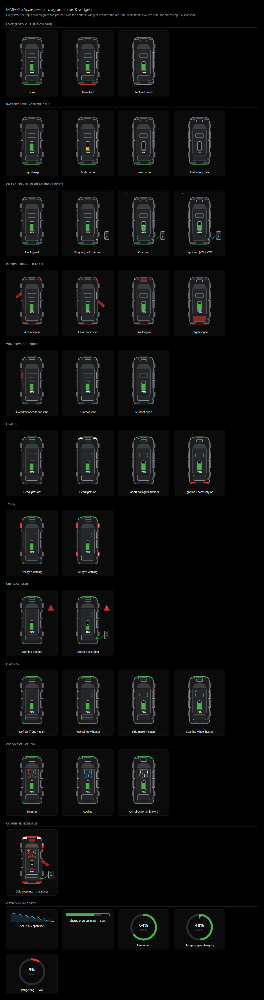

# Kia Access — MagicMirror module + Home Assistant integration

[](https://github.com/Legal-Copy7045/MMM-KiaAccess/actions/workflows/ci.yml)

Kia Connect / Bluelink vehicle data on **two surfaces built from one shared
engine**. Built for a **Kia EV9 (Kia USA)**, works with any Hyundai/Kia/Genesis
that [`hyundai_kia_connect_api`](https://github.com/Hyundai-Kia-Connect/hyundai_kia_connect_api)
supports.

- **MagicMirror² module** — a configurable `key → value` table plus an animated
  top-down car diagram (doors, lock, charge, climate, tyres…). Read-only.
- **Home Assistant integration** — sensors and binary sensors, **plus control**
  (lock / unlock / climate / charging), a Lovelace card that renders the same
  diagram, and `kia_access_alert` events for automations.

The two work **independently**. Or run both and have the module take its data
**from Home Assistant** instead of polling Kia itself — so the car is woken once,
not twice.

> **Why a Python library, not a Node one?**
> Kia USA sits behind Cloudflare bot protection that returns **HTTP 403** to the
> Node `bluelinky` library. `hyundai_kia_connect_api` (the library behind Home
> Assistant's Kia/Hyundai integration) handles it and is actively maintained.

---

## Which setup do you want?

| | who polls Kia | needs on the mirror | car control | dashboard |
|---|---|---|---|---|
| **A · MagicMirror only** | the module | Python venv + one-time OTP | – | the mirror |
| **B · Home Assistant only** | the integration | – | **yes** | Lovelace card |
| **C · MagicMirror fed by HA** | the integration (only) | just a HA token | via HA | both |

- Just a mirror, no Home Assistant → **A**.
- Home Assistant user who wants control and a dashboard tile → **B** (add a
  mirror later with **C**).
- Both a mirror **and** Home Assistant → **C**: HA polls the car once, the mirror
  reads that locally. No Python or OTP on the mirror.

---

## Install

### A · MagicMirror only

The module polls Kia directly through a small Python bridge (`kia_bridge.py`).

```bash
cd ~/MagicMirror/modules
git clone https://github.com/Legal-Copy7045/MMM-KiaAccess.git
cd MMM-KiaAccess
npm install          # runs setup_python.js: builds ./venv and installs the Python dep
```

Then add to `~/MagicMirror/config/config.js` and restart MagicMirror:

```js
{
  module: "MMM-KiaAccess",
  position: "top_left",
  header: "Kia EV9",
  config: {
    username: "you@example.com",
    password: "••••••••",
    pin: "1234",
    brand: "KIA",            // KIA | HYUNDAI | GENESIS
    region: "USA",           // USA | CA | EU | AU | CN | IN | NZ | BR
    visuals: { enabled: true }
    // include / labels / formatters / notifications / mqtt — see Configuration
  }
}
```

Mode A needs two more things: a modern **Python** (auto-provisioned, below) and a
**one-time OTP** enrollment (Kia USA, below).

#### Python version (mode A)

`hyundai_kia_connect_api` needs **Python ≥ 3.10** (current releases: 3.12+).
Anything older than 3.10 can only install v3.24.0, which **can no longer log in to
Kia USA**. Raspberry Pi OS *Bullseye* ships Python 3.9 — too old.

`setup_python.js` (run automatically by `npm install`) handles this:

1. Looks for the newest `python3.x` ≥ 3.10 — system, `pyenv`, or a previous download.
2. If none, on Linux it downloads a **self-contained CPython 3.12** from
   [python-build-standalone](https://github.com/astral-sh/python-build-standalone)
   into `./python-standalone/` (no compiler, ~2 min; arm64 / armv7-hf / x86_64).
3. Builds `./venv` from whichever it found and installs the library.

So on a Pi 3.9 box you normally just run `npm install` and it sorts itself out.

| Situation | Result |
|---|---|
| system Python ≥ 3.12 | latest library, used directly |
| system Python 3.10 / 3.11 | library ≥ 3.24.1, used directly |
| system Python ≤ 3.9 (Linux) | standalone CPython 3.12 downloaded automatically |
| offline / download blocked | set `MMM_KIA_NO_DOWNLOAD=1`; install Python ≥ 3.10 yourself, then re-run |

Overrides (env vars): `MMM_KIA_PYTHON=/abs/path/python3` to force an interpreter,
`MMM_KIA_PBS_RELEASE=<tag>` to pin a different standalone release.
Or set `pythonBin` in the module config to an absolute path.

If venv creation fails on Debian/RPi OS: `sudo apt install python3-venv`.

#### One-time OTP enrollment (mode A, Kia USA)

Kia USA requires a one-time passcode when a new client first logs in. Run the enrollment
script **once**, on the mirror, using the module's venv Python:

```bash
cd ~/MagicMirror/modules/MMM-KiaAccess
KIA_JOB='{"username":"you@example.com","password":"pw","pin":"1234","region":"USA","brand":"KIA"}' \
  ./venv/bin/python3 enroll.py
```

(Passing the details in `KIA_JOB` leaves the terminal free for the prompts and keeps the
password out of `ps`. `argv[1]` or stdin also work.)

It asks where to send the code (SMS / email), you paste the code back, and it writes
`token.json` (git-ignored, `chmod 600`) next to the script. `kia_bridge.py` then reuses
and silently refreshes that token — no more prompts until Kia expires the refresh token
(months away), at which point just run `enroll.py` again. If the module ever shows
*"OTP enrollment required"*, that's the signal.

### B · Home Assistant only

A native integration — the same data as mode A, **plus control**, plus a
Lovelace card. No MagicMirror required.

1. **Install the integration.** HACS → ⋮ → **Custom repositories** → add
   `https://github.com/Legal-Copy7045/MMM-KiaAccess`, category **Integration** →
   **Download** → **restart Home Assistant**.
   (Or copy `custom_components/kia_access/` into `config/custom_components/` and
   restart.)
2. **Add it.** **Settings → Devices & Services → + Add Integration → “Kia
   Access”**. Enter email / password / PIN / region; enter the SMS or email
   **OTP** when prompted. Tick *Reverse-geocode the parked location* if you want
   a location.
3. You now have one **device per vehicle**:
   - sensors + binary sensors (battery, range, charge power, doors, lock, plug,
     climate, tyre warning, …), generated from `core/entities.json`
   - **buttons**: `lock`, `unlock`, `stop climate`, `start charge`, `stop charge`
   - **services**: `kia_access.lock` … `kia_access.stop_charge` (no-arg), plus
     `kia_access.start_climate` (`set_temp` / `duration` / `defrost` / `heating`)
     and `kia_access.set_charge_limits` (`ac_limit` / `dc_limit`)
   - **`kia_access_alert`** events on the event bus for the same edge-triggered
     conditions the mirror notifies on (battery low, left unlocked, door open,
     charge complete / interrupted, 12V drain, OTP expiry) — use them in
     automations
4. **Add the dashboard card.** Edit a dashboard → **+ Add Card** → search “Kia
   Access”, or paste:
   ```yaml
   type: custom:kia-access-card
   # entity: sensor.<vehicle>_status   # optional; auto-detected otherwise
   ```
   The integration serves and auto-registers `/kia_access/kia-access-card.js`.
   If the card doesn't show up, hard-refresh the browser, or add that path as a
   **Lovelace resource** (type: JavaScript Module) manually.

Poll interval and the live-wake-up timeout are in the integration's
**Configure** dialog. The rotated refresh token is stored in the config entry —
nothing is written into the HACS-managed folder.

### C · MagicMirror fed by Home Assistant

Do **mode B first** so Home Assistant is polling the car. Then the module reads
from HA over the local REST API — **no Kia credentials, no OTP, no Python bridge
on the mirror**, and the car is only ever woken by HA.

```bash
cd ~/MagicMirror/modules
git clone https://github.com/Legal-Copy7045/MMM-KiaAccess.git
cd MMM-KiaAccess
npm install
```

(`npm install` still builds the Python venv via `postinstall`; it's unused in
this mode and harmless. Set `MMM_KIA_NO_DOWNLOAD=1` to skip the download.)

In Home Assistant: your profile → **Security → Long-Lived Access Tokens →
Create Token**. Then in `~/MagicMirror/config/config.js`:

```js
{
  module: "MMM-KiaAccess",
  position: "top_left",
  header: "Kia EV9",
  config: {
    source: "homeassistant",
    homeassistant: {
      url: "http://homeassistant.local:8123",   // or http://<ha-ip>:8123
      token: "<the long-lived access token>",
      entity: "sensor.my_ev9_status",            // optional; Developer Tools → States → filter your car
      mode: "push"                               // "push" (default) | "poll" — see below
    },
    visuals: { enabled: true }
    // include / labels / formatters / notifications / mqtt all work exactly as in mode A
  }
}
```

Check it before restarting MagicMirror (this runs the exact code path the module
uses):

```bash
cd ~/MagicMirror/modules/MMM-KiaAccess
node -e "require('./ha_source.js').fetchFromHA({url:'http://homeassistant.local:8123',token:'<token>',entity:'sensor.my_ev9_status'}).then(r=>console.log(JSON.stringify(r._meta,null,2))).catch(e=>console.error('FAIL:',e.message))"
```

Good output: `{ "source": "homeassistant", "haEntity": "…", … }`. The vehicle
values may be `null` until the car's first Kia sync — that only means the
connection works. A `FAIL:` line gives the exact reason (bad token, wrong URL,
entity not found).

From here the module is identical to mode A — same diagram, table, sparklines,
history, notifications and optional MQTT re-publishing — it just gets its data
from Home Assistant.

**How it stays current** — `homeassistant.mode`:

- **`"push"` (default)** — opens one persistent WebSocket to HA and gets
  `state_changed` events pushed the instant they happen (0 s lag). Needs
  **Node ≥ 22** for the built-in `WebSocket`; on older Node it automatically
  falls back to polling. `updateInterval` here is just a slow liveness/fallback
  check — defaults to **5 min**.
- **`"poll"`** — plain REST reads every `updateInterval`, which defaults to
  **30 s** in this mode. Use it if the WebSocket can't reach HA (proxy, auth
  quirk) or you're on older Node.

Either way the module only re-renders / re-checks conditions / writes its disk
cache when the data actually changed, so a fast rate costs almost nothing.

## Configuration

> Applies to the **MagicMirror module** (modes A and C). In mode C, drop
> `username` / `password` / `pin` and add the `source` / `homeassistant` block
> shown above; everything else below is the same. Home Assistant's own options
> are in its **Configure** dialog.

```js
{
  module: "MMM-KiaAccess",
  position: "bottom_right",
  header: "Kia EV9",
  config: {
    // --- Kia Connect / Bluelink account ---
    username: "you@example.com",
    password: "••••••••",
    pin: "1234",
    brand: "KIA",            // KIA | HYUNDAI | GENESIS
    region: "USA",           // USA | CA | EU | AU | CN | IN | NZ | BR
    vin: "",                 // blank = first vehicle on the account

    // --- runtime ---
    pythonBin: "python3",    // command that runs kia_bridge.py
    fetchTimeout: 90,        // seconds before the bridge is killed

    // --- polling ---
    updateInterval: 30 * 60 * 1000,  // 30 min — see "Battery" note
    retryInterval: 5 * 60 * 1000,
    refresh: true,           // true = poll the car; false = Kia's cached copy
    units: "imperial",       // imperial | metric

    // --- which attributes to show ([] = show everything) ---
    include: [
      "vehicle.ev_battery_percentage",
      "vehicle.ev_battery_is_charging",
      "vehicle.ev_battery_is_plugged_in",
      "vehicle.ev_driving_range",
      "vehicle.ev_estimated_current_charge_duration",
      "vehicle.car_battery_percentage",
      "vehicle.odometer",
      "vehicle.is_locked",
      "vehicle.*_door_is_open",
      "vehicle.trunk_is_open",
      "vehicle.hood_is_open",
      "vehicle.air_control_is_on",
      "vehicle.tire_pressure_*",
      "vehicle.last_updated_at",
      "_meta.fetchedAt"
    ],
    exclude: ["vehicle.data.*", "vehicle.VIN"],
    order: ["vehicle.ev_*", "vehicle.odometer", "vehicle.*_door_*"],
    labels: {
      "vehicle.ev_battery_percentage": "Battery",
      "vehicle.ev_driving_range": "Range",
      "vehicle.ev_battery_is_charging": "Charging",
      "vehicle.ev_battery_is_plugged_in": "Plugged In",
      "vehicle.car_battery_percentage": "12V Battery",
      "vehicle.odometer": "Odometer",
      "vehicle.is_locked": "Locked",
      "vehicle.last_updated_at": "Car Last Reported",
      "_meta.fetchedAt": "Last Fetched"
    },
    formatters: {
      "vehicle.ev_battery_percentage": "percent",
      "vehicle.car_battery_percentage": "percent",
      "vehicle.ev_driving_range": "distanceKm",
      "vehicle.odometer": "distanceKm",
      "vehicle.ev_battery_is_charging": "boolean",
      "vehicle.ev_battery_is_plugged_in": "boolean",
      "vehicle.is_locked": "boolean",
      "vehicle.air_control_is_on": "boolean",
      "vehicle.last_updated_at": "relativeTime",
      "_meta.fetchedAt": "relativeTime"
    }
  }
}
```

### Discovering every available attribute

Set `include: []` and `exclude: []`, restart, and every attribute renders. Each row's
hover tooltip is its exact key path — copy the ones you want. Everything lives under
`vehicle.` (plus `_meta.`). The full raw API response is under `vehicle.data.*`.

Common EV9 (US) paths:

| Path | Meaning |
|---|---|
| `vehicle.ev_battery_percentage` | Drive battery state of charge (%) |
| `vehicle.ev_battery_soh_percentage` | Battery state of health (%) |
| `vehicle.ev_battery_is_charging` / `ev_battery_is_plugged_in` | Charging / plugged in |
| `vehicle.ev_driving_range` (+ `_unit`) | Estimated EV range |
| `vehicle.ev_charging_power` | Current charge rate (kW) |
| `vehicle.ev_estimated_current_charge_duration` | Minutes to target |
| `vehicle.ev_charge_limits_ac` / `ev_charge_limits_dc` | Charge target % |
| `vehicle.car_battery_percentage` | 12V battery (%) |
| `vehicle.odometer` (+ `odometer_unit`) | Mileage |
| `vehicle.is_locked` | Doors locked |
| `vehicle.front_left_door_is_open` … `back_right_door_is_open` | Individual doors |
| `vehicle.trunk_is_open` / `hood_is_open` | Trunk / frunk |
| `vehicle.*_window_is_open` | Windows |
| `vehicle.air_control_is_on` / `defrost_is_on` / `steering_wheel_heater_is_on` | Climate |
| `vehicle.air_temperature` / `outside_temperature` | Temperatures |
| `vehicle.tire_pressure_front_left` … `tire_pressure_rear_right` | Tyre pressures |
| `vehicle.tire_pressure_*_warning_is_on` | Tyre pressure warnings |
| `vehicle.location_latitude` / `location_longitude` | GPS |
| `vehicle.last_updated_at` / `last_scanned_at` | Freshness timestamps |
| `_meta.fetchedAt` | When this module last fetched |

## Config options

| Option | Default | Notes |
|---|---|---|
| `source` | `"kia"` | `"kia"` = poll Kia directly (modes A). `"homeassistant"` = read from the native integration (mode C) |
| `homeassistant.url` | `""` | mode C only — e.g. `http://homeassistant.local:8123` |
| `homeassistant.token` | `""` | mode C only — a HA long-lived access token |
| `homeassistant.entity` | `""` | mode C only — the `…_status` summary sensor; auto-detected when blank |
| `homeassistant.mode` | `"push"` | mode C only — `"push"` (live WebSocket, Node ≥ 22) or `"poll"` (REST every `updateInterval`) |
| `username` / `password` / `pin` | `""` | Kia Connect / Bluelink credentials. **Required for mode A**; not used when `source: "homeassistant"` |
| `brand` | `"KIA"` | `KIA` \| `HYUNDAI` \| `GENESIS` (mode A) |
| `region` | `"USA"` | `USA` `CA` `EU` `AU` `CN` `IN` `NZ` `BR` (mode A) |
| `vin` | `""` | Blank = first vehicle on the account (mode A) |
| `pythonBin` | `"python3"` | mode A — command used to run the bridge (`PYTHON` env var also works) |
| `fetchTimeout` | `90` | Seconds before the bridge process is killed |
| `updateInterval` | `1800000` | ms between fetches. **Mode C** default: `300000` (push — fallback poll) or `30000` (poll) |
| `retryInterval` | `300000` | ms before retrying after an error (**mode C** default: `30000`) |
| `refresh` | `true` | `true` wakes the car; `false` uses Kia's server cache (no battery cost). Use `false` for a **brand-new car that hasn't synced yet** |
| `forceRefreshTimeout` | `45` | seconds to wait for the `refresh: true` wake-up before falling back to Kia's cached copy for that poll |
| `backoffMax` | `8` | cap the post-failure exponential backoff at `retryInterval × this` |
| `maxRequestsPerHour` | `0` | `0` = no cap; otherwise pause fetches once the cap is hit (protects the account) |
| `historyDays` | `60` | days of SoC / 12V history kept on disk (`cache/`) for the sparkline + drain alert |
| `historyMinIntervalMinutes` | `30` | don't record history samples closer together than this |
| `otpLifetimeDays` | `30` | assumed Kia refresh-token lifetime, used for the expiry warning |
| `otpWarnDays` | `7` | start showing "OTP expires in N days" this far out |
| `geocode` | `false` | resolve `vehicle.geocode` to a street address via OpenStreetMap |
| `units` | `"imperial"` | `"imperial"` or `"metric"` for distance/temp/speed formatters |
| `decimals` | `1` | rounding for numeric formatters |
| `nullText` | `"—"` | shown for `null` / `undefined` |
| `include` | `[]` | glob paths to show; empty = all |
| `exclude` | `["vehicle.data.*", "vehicle.VIN"]` | glob paths to hide |
| `hideWhenFalsy` | `[]` | glob paths whose row is dropped when the value is `false` / `0` / `null` / `""` / `"—"` (use for "only show when true / non-zero") |
| `order` | `[]` | glob paths shown first, in listed order |
| `labels` | `{}` | key path → display label |
| `formatters` | see defaults | key path → formatter name |
| `visuals.enabled` | `false` | master switch for the graphical widgets |
| `visuals.car` / `.battery` / `.rowIcons` | `true` | individual widget toggles (need `visuals.enabled`) |
| `visuals.width` | `210` | px width of the car SVG |
| `visuals.compact` | `false` | one-line summary (`78% · 312 mi · 🔒`) instead of the diagram + table |
| `visuals.chargeProgress` | `true` | progress bar + "full at HH:MM" while plugged in |
| `visuals.rangeRing` | `false` | radial SoC / range gauge under the car |
| `visuals.socHistory` | `false` | EV-battery-% sparkline (`visuals.socHistoryDays`, default 14) |
| `visuals.v12History` | `false` | 12V-battery-% sparkline (`visuals.v12HistoryDays`, default 14) — spot vampire drain |
| `visuals.tripStats` | `false` | distance / consumption / regen from `month_trip_info` |
| `visuals.location` | `{ enabled:false }` | "N mi from home" + address, optional static `map` — see [Location](#location--map) |
| `visuals.chargeCost` | `{ enabled:false }` | estimated cost to the charge target (`pricePerKwh`, `currency`) |
| `visuals.batteryDetail` | range + charge rate/current + 4 charge-time estimates | keys shown under the car and removed from the table |
| `icons` | `{}` | key path → Font Awesome class, overrides the built-in row-icon map |
| `notifications.enabled` | `false` | emit edge-triggered `KIA_ACCESS_STATE_CHANGED` / `alert` on state changes — see [Notifications](#notifications-state-changes) |
| `mqtt.enabled` | `false` | publish full state to retained MQTT topics — see [MQTT](#mqtt-state-publishing) |
| `notifications.criticalAlertSeconds` | `0` | critical `alert` popups: `0` = stay until the condition clears; `>0` = auto-dismiss after N s |
| `showHeaderCount` | `true` | append attribute count to the header |
| `showUpdatedFooter` | `true` | show "updated HH:MM:SS" footer |
| `maxWidth` | `"420px"` | CSS max-width |
| `animationSpeed` | `500` | fade (ms) when the module re-renders; **`0` = no fade**. The module only re-renders when the data changed, so at rest there's no fade regardless |
| `debug` | `false` | extra logging |

### Graphical mode

Set `visuals.enabled: true` to add pictorial widgets above the table. Each part
toggles independently:

```js
visuals: {
  enabled: true,
  car: true,          // top-down SUV diagram, front at the top (fixed size —
                      //   the car never moves or resizes between states)
  battery: true,      // a small vertical battery toward the rear of the cabin
                      //   (terminal to the front), filling bottom-up, coloured
                      //   green/amber/red, % shown underneath, animated bolt
                      //   when charging
  rowIcons: true,     // Font Awesome icon before every table row
  width: 210,         // px width of the car SVG
  batteryDetail: [    // readouts under the car (and removed from the table).
    "vehicle.ev_driving_range",              // Rendered with your labels /
    "vehicle.ev_charging_power",             // formatters, and hidden by
    "vehicle.ev_charging_current",           // hideWhenFalsy just like rows —
    "vehicle.ev_estimated_current_charge_duration",   // so the charge-time
    "vehicle.ev_estimated_fast_charge_duration",      // lines only appear
    "vehicle.ev_estimated_station_charge_duration",   // while actually
    "vehicle.ev_estimated_portable_charge_duration"   // charging
  ]
}
```

The car diagram:

- **lock state = body outline colour** — green (locked) / red (unlocked) / grey
  (unknown). There is no lock icon or text; drop the `is_locked` row from the
  table and let the outline carry it.
- **doors** swing out ~50° and pulse red when open. A **window** open with the
  door shut leaves the door in place and pulses it red.
- **frunk** (small box by the windscreen) and the **SUV liftgate** (rear window +
  tailgate as one block) turn red / pulse when open.
- **sunroof** — a panel outline on the roof: grey shut, pulsing red outline open.
- **headlights** solid white when on, hollow outline when off/unknown.
- **taillights** solid red when the car is running / in accessory mode
  (`engine_is_running` / `accessory_on` / `ign3` / `remote_ignition`), outline when off.
- **defrost** (`defrost_is_on`) → orange element lines on the windscreen *and* the
  liftgate; **rear-window heater** (`back_window_heater_is_on`) → lines on the
  liftgate only. **Mirror heater** (`side_mirror_heater_is_on`) → the mirrors glow
  orange. **Steering-wheel heater** (`steering_wheel_heater_is_on`) → an orange
  ring in the driver's area.
- **air conditioning** (`air_control_is_on`) → four air streams from a front vent
  bar: **orange when heating, cyan when cooling** (inferred from `air_temperature`
  vs `outside_temperature`), neutral white when the direction is unknown.
- **wheels** show a `!` on a per-tyre pressure warning (all four for the
  "all tyres" warning).
- **critical issue** → a pulsing red warning triangle in the front-right margin
  whenever any `critical` condition is active (tyre pressure, a fault lamp, a
  hard-low battery). Shows regardless of whether `notifications` are enabled.
- **plugged in** → a wall-box + cable appear at the rear-right charge port.
  Charging: the port pulses green and particles flow charger → car. Exporting
  (`ev_v2l_status` / `ev_v2x_status`): the flow reverses in cyan. Plugged but
  idle: a static amber cable.

`ev_battery_percentage` and every `batteryDetail` key are dropped from the table
automatically so nothing is duplicated. The diagram always reads the real
`vehicle.*` values, so it stays complete even for rows you've hidden.

#### Every state, visually

Every diagram state and every optional widget:



Open [`docs/car-states.html`](docs/car-states.html) for the same gallery with the
animations playing. Regenerate it from the current `core/visuals.js` with
`node docs/build-gallery.js` (the PNG is a screenshot of that page).

#### Extra widgets

Each is off by default and stacks under the car:

- **`compact`** — replaces everything with one line: `78% · 312 mi · 🔒 · ⚡ 7.4 kW`.
- **`chargeProgress`** — while plugged in, a bar (current + target) and either
  "Full (80%) at 06:40" or "Plugged in, not charging".
- **`rangeRing`** — a radial gauge: SoC on the ring, range in the centre.
- **`socHistory`** / **`v12History`** — battery-% sparklines (EV and 12V) over the
  last N days, from the history the helper keeps on disk. `v12History` is the one
  to watch for a slow parasitic drain.
- **`tripStats`** — this month's distance / average consumption / regen.
- **`chargeCost`** — `{ enabled: true, pricePerKwh: 0.14, currency: "$" }` →
  "Est. cost to 80%: $6.40" (needs `ev_battery_capacity`).

A **preconditioning schedule** is shown automatically whenever one is set on the
car (`ev_first_departure_enabled`) — "Departure 07:00 · Mon–Fri · preheat 21°".

#### Location & map

```js
visuals: {
  location: {
    enabled: true,
    homeLat: 40.71374,          // both set -> "3.2 mi from home" / "At home"
    homeLon: -79.75464,
    map: true,                  // show a static map image
    mapZoom: 14,
    mapWidth: 210, mapHeight: 120,
    mapUrlTemplate: "https://staticmap.openstreetmap.de/staticmap.php?center={lat},{lon}&zoom={zoom}&size={w}x{h}&markers={lat},{lon},red-pushpin"
  }
}
```

`{lat} {lon} {zoom} {w} {h}` are substituted. The default keyless OpenStreetMap
endpoint is rate-limited and sometimes down — for a reliable map, point
`mapUrlTemplate` at your own provider (Geoapify / Mapbox / Google static maps).
Enabling `location` turns `geocode` on automatically so the address resolves.

Row icons come from a built-in map (battery → battery, range → road, lock → lock,
charging → bolt, door → car-side, …) with keyword fallbacks. Override any of them:

```js
icons: {
  "vehicle.ev_battery_percentage": "fa-solid fa-bolt",
  "vehicle.geocode": "fa-solid fa-house"
}
```

### Formatters

`raw`, `boolean` (→ Yes/No), `percent`, `distanceKm`, `distanceMi`, `temperatureC`,
`speedKph`, `durationMin` (minutes → `2h 14m`), `datetime`, `relativeTime`.
Distance/temp/speed honour `units`.

### Glob syntax

`*` matches within one path segment, `**` across segments, `?` one char. A plain string
with no wildcard matches that exact path **or** anything beneath it.

## Notifications (state changes)

Set `notifications.enabled: true` to emit a notification whenever a monitored
condition changes — **edge-triggered**, so it fires once when the state flips,
not on every refresh.

```js
notifications: {
  enabled: true,
  alertModule: true,           // also pop MagicMirror's built-in `alert` module
  alertSeconds: 15,            // warning alerts auto-dismiss after this many seconds
  criticalAlertSeconds: 0,    // critical alerts: 0 = stay on screen until the condition clears
  notifyOnStartup: "critical", // false | "critical" | true — what fires on the
                               //   first data after a restart
  quietWhileDriving: true,     // suppress open-part / unlocked while the car is on
  checks: {
    evBatteryLow:  { belowPct: 20, clearPct: 25 },   // hysteresis: alert at ≤20,
    battery12vLow: { belowPct: 55, clearPct: 60 },    //   clear only at ≥25
    windowOpen: false,                                // disable a check entirely
    doorOpen: { level: "critical" },                  // promote to a persistent alert
    chargeInterrupted: { minGapPct: 3 }
  }
}
```

**Levels & persistence.** Each check has a `level` — `info` / `warning` /
`critical`. `alertModule` pops the `alert` module for `warning` and `critical`
only. A `warning` alert auto-dismisses after `alertSeconds` (15 s); a `critical`
alert stays on screen until the condition **clears** (set `criticalAlertSeconds`
> 0 to auto-dismiss it instead). Override any check's level —
`checks: { doorOpen: { level: "critical" } }` — to make it persist.

**Built-in checks** (default level in brackets):

| check | default | fires when |
|---|---|---|
| `tyrePressure` | **critical** | a tyre-pressure warning is on |
| `vehicleFault` | **critical** | any real fault lamp the car reports is on — brake fluid, 12V system, ABS, airbag (not washer fluid / key-fob battery) |
| `evBatteryLow` | warning | drive battery ≤ `belowPct` (20) |
| `evBatteryCritical` | **critical** | drive battery ≤ `belowPct` (8) — a hard floor alongside `evBatteryLow` |
| `battery12vLow` | warning | 12V battery ≤ `belowPct` (55) |
| `battery12vCritical` | **critical** | 12V battery ≤ `belowPct` (40) — "the car may not start" |
| `battery12vDrain` | warning | 12V fell `dropPct` over `overHours` while parked — the "won't start on a cold morning" one |
| `unlocked` | warning | vehicle unlocked (muted while driving) |
| `doorOpen` / `hoodOpen` / `liftgateOpen` | warning | that part is open |
| `windowOpen` / `sunroofOpen` | info | *(info = no `alert` popup)* |
| `chargeComplete` | info | charging finished at target (one-shot) |
| `chargeInterrupted` | warning | charging stopped early (one-shot) |
| `otpExpiring` | warning | OTP within `otpWarnDays` of expiry (mode A) |

`info`-level checks broadcast the `KIA_ACCESS_STATE_CHANGED` notification but
don't pop the `alert` module.

**For other modules** — a semantic notification is broadcast each time:

```js
this.sendNotification("KIA_ACCESS_STATE_CHANGED", {
  reason: "door_open",              // stable slug
  level: "warning",
  active: true,                     // true = entered, false = cleared
  title: "Kia EV9",
  message: "Front-left door is open",
  value: { corners: ["FL"] },
  vin: "…",
  at: "2026-09-08T18:20:00.000Z"
});
```

`chargeComplete` / `chargeInterrupted` are one-shot (only `active: true` fires).
Everything else fires on both edges.

## MQTT (state publishing)

> **Do you need this?** Only in **mode A**. If you run the native Home Assistant
> integration (mode B/C) you already have proper entities — don't also enable
> `mqtt.homeAssistant` or you'll get a second, duplicate set. MQTT here is the
> way to get a mode-A mirror's data into HA / Node-RED / dashboards *without*
> the integration.

Optional — publishes the **full flattened vehicle state** to retained topics
after every fetch. Needs the `mqtt`
package (an `optionalDependency`, installed by `npm install`; if it's missing the
module just logs a warning):

```js
mqtt: {
  enabled: true,
  url: "mqtt://192.168.1.8:1883",
  username: "mqttuser",
  password: "…",
  topicPrefix: "kia/ev9",
  retain: true,
  publishJson: true              // also <prefix>/state as one JSON blob
}
```

Topics: `kia/ev9/ev_battery_percentage`, `kia/ev9/is_locked`,
`kia/ev9/tire_pressure_front_left`, … plus `kia/ev9/state` (JSON),
`kia/ev9/_meta/fetched_at`, `kia/ev9/_meta/stale`, and `kia/ev9/status`
(`online` / `offline` via LWT). Current-state only — derive change triggers
downstream, or use the `KIA_ACCESS_STATE_CHANGED` notification above.

The raw API dump (`vehicle.data.*`, which includes GPS) is **not** fanned out
to individual retained topics; set `mqtt.publishRaw: true` if you want it. The
`kia/ev9/state` JSON blob still contains everything (turn it off with
`publishJson: false`).

### Home Assistant discovery (mode A only)

**Skip this if you use the native integration (mode B/C)** — it already gives
you these entities, better. This path is for a mode-A mirror that wants entities
in HA without installing the integration.

```js
mqtt: {
  enabled: true,
  url: "mqtt://192.168.1.8:1883",
  topicPrefix: "kia/ev9",
  homeAssistant: { enabled: true, discoveryPrefix: "homeassistant" }
}
```

Publishes retained `homeassistant/…/config` messages so a curated set of entities
(battery %, health, 12V, range, charge power, ETA, odometer, outside temp, last
reported; charging / plugged / locked / doors / frunk / liftgate / sunroof / tyre
warning / defrost / climate binary sensors) appear in Home Assistant
automatically, grouped under one device, with `kia/ev9/status` as availability.

## Reliability

- **Live wake-up is time-boxed.** With `refresh: true` the bridge asks the car to
  report fresh data, but only waits `forceRefreshTimeout` seconds — if the
  wake-up hangs (common for a car that has **never synced**), it falls back to
  Kia's server-cached copy for that poll and notes it. A fresh EV9 should run
  `refresh: false` until it has checked in once.
- **Last-known-state cache.** The last good payload is saved to `cache/` and
  re-served (dimmed, with a "cached" footer and a warning strip) whenever a fetch
  fails outright, so the widgets never go blank during a Kia outage or restart.
- **Backoff.** After a failure, retries slow down exponentially
  (`retryInterval`, ×2, ×4, … capped at `retryInterval × backoffMax`) and reset
  on the next success.
- **Request cap.** `maxRequestsPerHour` (default off) pauses fetching once the cap
  is hit — Kia soft-locks accounts that poll too hard.

## OTP expiry

Kia's OTP can't be refreshed unattended (it needs the SMS/email code). The module
records when `enroll.py` ran and shows **"OTP expires in ~N days — re-run
enroll.py"** once you're within `otpWarnDays` of `otpLifetimeDays` (both
configurable; the 30-day default is an estimate — tune it to what you observe).
The `otpExpiring` notification check fires the same warning to other modules.

## Notes

- **12V battery:** every `refresh: true` poll wakes the car. Kia's own app polls roughly
  every 30–60 min. Lower risks draining the 12V battery in cold weather. Use
  `refresh: false` for frequent updates from Kia's cache.
- The MagicMirror module is **read-only**. Car control (lock / unlock / climate /
  charging) is in the Home Assistant integration — see mode B.
- Test the bridge directly:
  ```bash
  echo '{"username":"you@example.com","password":"pw","pin":"1234","region":"USA","brand":"KIA","refresh":false}' | python3 kia_bridge.py
  ```
- Trigger an immediate refresh from another module with
  `this.sendNotification("MMM_KIA_ACCESS_REFRESH")`.

## Tests

```bash
npm test
```

## Project layout

**Define a feature once.** The shared engine lives in `core/` and at the repo
root, and every surface (MagicMirror, the HA integration, the Lovelace card) is
generated from it:

| file | purpose |
| --- | --- |
| `core/entities.json` | canonical catalogue of vehicle entities — MQTT discovery, HA sensors/binary-sensors and the card's table all generate from this |
| `core/commands.json` | canonical control commands — HA services, HA buttons and the card's action buttons generate from this |
| `core/state.js` / `vehicle_state.py` | `buildState(flat)` — flat payload → normalised diagram/condition state (JS + Python ports) |
| `core/conditions.js` / `conditions.py` | edge-triggered alert rules `evaluate(state, cfg, prev)` (JS + Python ports) |
| `core/visuals.js` | SVG car diagram, battery, sparkline, range ring, charge bar |
| `core/flatten.js` | flatten / glob-select / format helpers |
| `core/ha-discovery.js` | Home Assistant MQTT discovery, built from `entities.json` |
| `kia_client.py` | shared Kia client (auth, token, fetch, control) — used by the MM bridge and the HA integration |
| `card/kia-access-card.src.js` | the Lovelace card class |

`fixtures/*.json` are scenarios run through **both** the JS and Python engines
in CI (`test/contract.test.js`, `test/contract_test.py`) — any drift between the
ports fails the build.

`scripts/sync-core.js` vendors the shared files into
`custom_components/kia_access/`, generates its `services.yaml`, and bundles the
card (`frontend/kia-access-card.js` = catalogues + `core/{state,visuals,
conditions}.js` + the card class). `npm test` / CI fail if anything is stale —
run `npm run sync` after editing `core/`.

The MagicMirror front end (`MMM-KiaAccess.js`), `node_helper.js` and the Python
bridge (`kia_bridge.py`) stay at the repo root as MagicMirror requires.

## Home Assistant — reference

Install and setup are **mode B** above. Some details:

- **How the card gets its data.** The integration adds one diagnostic sensor,
  `sensor.<vehicle>_status`, whose attributes carry the whole flat vehicle
  payload (`kia_access_raw: true`). The card — and the module in mode C — read
  only that one entity, so neither costs any extra polling of Kia.
- **Control.** Buttons cover the no-argument commands; `set_charge_limits` and
  the parameterised `start_climate` are services only. All of them refresh the
  coordinator afterwards. Multiple accounts: pass `entry_id` in the service
  call.
- **Alerts in automations.** Trigger on `event_type: kia_access_alert`; the
  `event_data` has `reason`, `level`, `active`, `message`, `vin`, `entry_id`.
- **Token / re-auth.** The refresh token lives in the config entry and is
  re-saved when Kia rotates it (nothing is written into the HACS-managed
  folder). If Kia ever forces a new one-time code, HA shows a **"Reconfigure"
  / re-authenticate** prompt on the integration — enter the password and the
  new code there; no need to delete and re-add.

## Credits

- [`hyundai_kia_connect_api`](https://github.com/Hyundai-Kia-Connect/hyundai_kia_connect_api)
- Formatter/flatten design informed by [`bluelinky`](https://github.com/Hacksore/bluelinky)

## License

MIT
