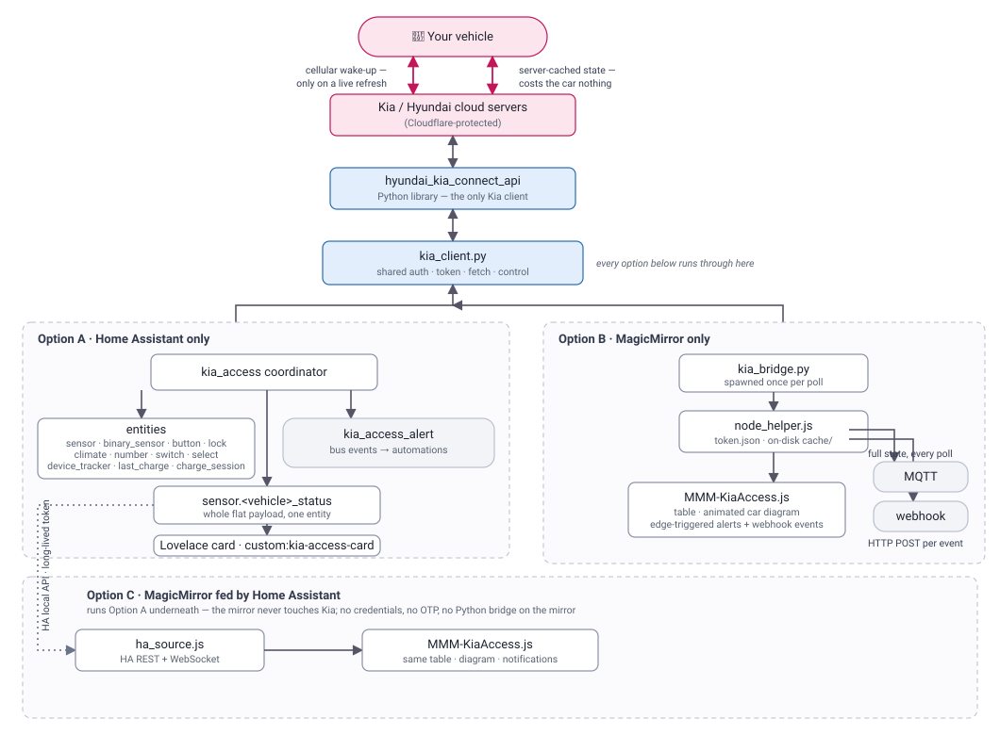

# Kia Access — one shared engine for Home Assistant **and** MagicMirror²

[](https://github.com/Legal-Copy7045/MMM-KiaAccess/actions/workflows/ci.yml)

**Kia Connect / Bluelink vehicle data and controls, defined once and delivered on
two surfaces.** One engine (`core/`) turns the
[`hyundai_kia_connect_api`](https://github.com/Hyundai-Kia-Connect/hyundai_kia_connect_api)
vehicle model into:

- a **Home Assistant integration** (HACS) — sensors and binary sensors, **native
  control entities** (`lock`, `climate`, `number`, `switch`, `select`) plus
  services, a `device_tracker` for the car's GPS, `kia_access_alert` events for
  automations, and a bundled **Lovelace card** with a top-down car diagram +
  climate panel;
- a **MagicMirror² module** — a configurable `key → value` table plus the same
  animated car diagram, with edge-triggered notifications and optional MQTT
  publishing. Read-only.

Every entity, command, alert rule and the diagram itself come from the **same
shared files**, so the two surfaces always show the same data and behave the same
way. Run either on its own — or run both and have the mirror read from Home
Assistant, so the car is only ever woken once.

> **Fresh readings vs. the 12V battery — your choice.** Each poll can either
> **wake the car** for live data, or read the **cached values Kia / Hyundai
> already hold on their servers** (which costs the car nothing). Repeatedly
> waking a parked car is the main way an app flattens its 12V battery in cold
> weather, so cached reads are the safe choice for frequent updates — and the
> live wake-up is time-boxed anyway, falling back to the cached copy if the car
> doesn't answer in time.
> - **MagicMirror** — `refresh: true` wakes the car, `refresh: false` uses the
>   cache. `forceRefreshTimeout` bounds the wake-up.
> - **Home Assistant** — **Configure → Poll the car directly**: off (the
>   default) reads only Kia's server cache; on wakes the car every poll, bounded
>   by **Live wake-up wait**. Poll frequency is the **Scan interval** next to it.

## Supported vehicles

Anything [`hyundai_kia_connect_api`](https://github.com/Hyundai-Kia-Connect/hyundai_kia_connect_api)
supports:

- **Brands** — Kia (Connect / UVO), Hyundai (Bluelink), Genesis
- **Regions** — USA, Canada, Europe, Australia, India, China, New Zealand, Brazil
- **Powertrains** — EV, PHEV, HEV and ICE. The EV-specific sensors and diagram
  parts (charge, plug, drive battery) simply stay empty on a car that doesn't
  have them.

Developed and tested against a **Kia EV9 on Kia USA**. Other brands, regions and
models go through the same library but are less battle-tested —
[open an issue](https://github.com/Legal-Copy7045/MMM-KiaAccess/issues) if
something looks wrong.

> **Region notes**
> - **Kia USA / Canada** require a **one-time OTP** (an SMS / email code) the
>   first time a new client logs in. Home Assistant asks for it in the config
>   flow; the mirror has a one-time `enroll.py`.
> - The Kia US / CA API reports **°F** and **miles** — the engine normalises
>   everything to °C / km at the source, then the formatters render back to the
>   units you pick.
> - The climate set-point for **USA** is sent in **°F (62–82)**; EU and other
>   regions use **°C (16–30)**.

> **Why a Python library, not a Node one?**
> Kia USA sits behind Cloudflare bot protection that returns **HTTP 403** to the
> Node `bluelinky` library. `hyundai_kia_connect_api` — the library behind Home
> Assistant's official Kia/Hyundai integration — handles it and is actively
> maintained. Both surfaces call it through the shared `kia_client.py`.

---

## Which setup do you want?

| | polls the car | dashboard | car control | extra setup |
|---|---|---|---|---|
| **A · Home Assistant** | the integration | Lovelace card | ✅ | OTP in the config flow |
| **B · MagicMirror only** | the module (Python bridge) | the mirror | – | Python venv + one-time OTP |
| **C · MagicMirror + Home Assistant** | Home Assistant only | both | ✅ via HA | a HA token on the mirror |

- **Home Assistant user** → **A**. Add a mirror later with **C**.
- **Just a mirror**, no Home Assistant → **B**.
- **Both** → **C**: HA polls the car once, the mirror reads it locally — no
  Python, no OTP and no second wake-up on the mirror.

---

## How the data flows

Every option reaches the car through the same shared client
(`hyundai_kia_connect_api` → `kia_client.py`); each poll either wakes the car for
live data or reads the cached copy Kia / Hyundai already hold. From there the
three options diverge:



The [Mermaid source](docs/data-flow.mmd) is the editable original.

**Getting the data elsewhere** — with Home Assistant (A / C) you have entities,
the `kia_access_alert` event bus and the `sensor.<vehicle>_status` payload, so
anything HA integrates with is already covered. A MagicMirror-only mirror (B)
can push out over **[MQTT](#mqtt-state-publishing)** (full state, retained
topics + HA discovery) or a **[webhook](#webhook-http-post-per-event)** (an HTTP
`POST` per state-change event, for Discord / Slack / IFTTT / a cloud function).

---

## Install

### A · Home Assistant

A native integration — sensors and binary sensors, **plus control**, plus a
Lovelace card. No MagicMirror required.

1. **Install the integration.** HACS → ⋮ → **Custom repositories** → add
   `https://github.com/Legal-Copy7045/MMM-KiaAccess`, category **Integration** →
   **Download** → **restart Home Assistant**.
   (Or copy `custom_components/kia_access/` into `config/custom_components/` and
   restart.)
2. **Add it.** **Settings → Devices & Services → + Add Integration → “Kia
   Access”**. Enter your Kia Connect / Hyundai Bluelink email / password / PIN
   and pick the region; enter the SMS or email **OTP** when prompted (Kia
   USA / CA). Tick *Reverse-geocode the parked location* if you want a location.
3. You now have one **device per vehicle**:
   - sensors + binary sensors (battery, range, charge power, doors, lock, plug,
     climate, tyre warning, next-service distance, valet mode, battery
     preconditioning, …), generated from `core/entities.json`
   - **`device_tracker.<vehicle>_location`** — the car's GPS position (with the
     EV battery % as `battery_level`), so HA's map card, zones, presence and
     "left home / arrived at work" automations work natively. Needs a GPS fix
     from the car; enable *Reverse-geocode* at setup for a street address too.
   - **`Last charge`** — cost (or kWh) of the most recent completed charge, with
     the session detail + a 30-/90-day total in its attributes
   - **`Charge session`** — a live figure that climbs while charging (ticks
     every 60 s on its own). Both need a price: **Settings → Devices &
     Services → Kia Access → Configure → Price per kWh** (and optional pack
     kWh). Sessions run plug-in → unplug and persist across restarts.
   - **`lock.<vehicle>_doors`** — a real HA lock (HomeKit / Google / Alexa,
     the lock card, `lock.lock` automations)
   - **`climate.<vehicle>_climate`** — remote climate as an HVAC entity
     (thermostat card, "set the car to 72", generic climate automations).
     `HEAT_COOL` / `OFF`; target temperature in °F for USA & Canada, °C
     elsewhere; current temperature from the car
   - **numbers** — `AC charge limit` / `DC charge limit` (dashboard sliders,
     50–100 %) and `Climate run time` (1–30 min)
   - **switches** — `Charging` (start/stop, shown only while plugged in),
     `Front defrost with climate`, `Rear defrost with climate`
   - **selects** — `Steering wheel heat with climate` and per-seat
     `… seat with climate` (Off / Heat · Cool low–high). These are *desired*
     settings folded into the next climate start
   - **buttons**: `lock`, `unlock`, `flash hazards`, `flash and honk` (find the
     car), `open` / `close charge port`, `start` / `stop charge`
   - **sensors** — fuel level & range, charge current, per-seat status, a
     `Remote action` diagnostic, **`Range reach`** (derated drive distance now;
     the `pois` attribute flags every `zone.*` one-way / round-trip and the
     **state-of-charge you'd arrive with**), `Last trip` + `Cost per mile`
     (from the auto trip log), and **`Parked`** — where the car was last seen
     parked, with Google / Apple / OSM map deep-links and distance from home
   - **services**: the no-arg buttons above, plus `kia_access.start_climate`
     (`set_temp` — **°F, 62–82** for the USA region — `duration`, `climate`,
     `defrost`, `heating`, `steering_wheel`, `front_left_seat` …
     `rear_right_seat`), `kia_access.stop_climate`,
     `kia_access.set_charge_limits` (`ac_limit` / `dc_limit`),
     `kia_access.send_to_car` (`name` + `address`, or `latitude` / `longitude`)
     — see [Send to car](#send-to-car) — and
     `kia_access.refresh_calendar_destinations` (re-read the calendars for the
     reachable-destinations list / range map now)
   - *(commands the car or region doesn't support just return a clear error
     when pressed)*
   - **`kia_access_alert`** events on the event bus for the same edge-triggered
     conditions the mirror notifies on (battery low, left unlocked, door open,
     charge complete / interrupted, 12V drain, OTP expiry) — use them in
     automations
4. **Add the dashboard card.** Edit a dashboard → **+ Add Card** → search “Kia
   Access”, or paste:
   ```yaml
   type: custom:kia-access-card
   # entity: sensor.<vehicle>_status   # optional; auto-detected otherwise
   # temperature_unit: F               # optional; "C" / "F" — otherwise follows HA
   ```
   The same bundle also provides **`custom:kia-range-map-card`** — an interactive
   map of how far you can drive (see [Location](#location--map)).
   The integration serves and auto-registers `/kia_access/kia-access-card.js`.
   If the card doesn't show up, hard-refresh the browser, or add that path as a
   **Lovelace resource** (type: JavaScript Module) manually.

   The card has a **Climate panel**: a temperature stepper (shown in °C / °F per
   your HA unit system, or the `temperature_unit` option; sent to the car as °F),
   a run-time stepper, Defrost / Rear+mirrors / Heated-wheel toggles, and
   **Start climate** / **Stop** buttons. Your last settings are remembered in the
   browser. For a fixed one-tap warm-up, call `kia_access.start_climate` from a
   script or automation instead.

The integration's **Configure** dialog holds **Scan interval**, **Poll the car
directly** (+ **Live wake-up wait**), **Price per kWh** / **capacity**, **Range
reach factor** / **reserve %**, **Calendar entities** / **Calendar look-ahead
(hours)** / **Static destinations** / **Zones to show**, and **Drive-time
provider** / **Routing API key** / **Geocoding API key** / **Per-destination
routes**. Leave **Poll the
car directly** off (the default) to only ever read Kia's cached data and never
wake the car — with it off, every update sends both `refresh: false` **and**
`forceRefreshTimeout: 0`, either of which alone stops the wake (see the note at
the top of this README); turn it on for live readings, bounded by **Live
wake-up wait**. The rotated refresh token is stored in the config entry —
nothing is written into the HACS-managed folder.

**Ownership extras (optional):** [`examples/ha-ownership-package.yaml`](examples/ha-ownership-package.yaml)
is a drop-in HA package that adds an efficiency proxy, a seasonal-range
comparison (full-charge range now vs your 60-day best), a **lease-mileage
tracker** with an excess-mileage cost projection, and a **maintenance /
renewals countdown** with one-tap "done" buttons. Edit the entity prefix and
the lease block, drop it in `config/packages/`, restart.

**Automation blueprints (optional):** in [`blueprints/automation/kia_access/`](blueprints/automation/kia_access/) —
import each with **Settings → Automations → Blueprints → Import** and paste the
raw GitHub URL:

| Blueprint | What it does |
|---|---|
| `precondition_on_calendar.yaml` | warm/cool the car N minutes before a calendar event — plugged-in only |
| `precondition_on_weather.yaml` | at a set weekday time, cool if hot / warm+defrost if cold, else skip |
| `alert_to_phone.yaml` | every `kia_access_alert` → a phone push, quiet hours, re-notify criticals, Lock / Start-charge buttons |
| `notification_actions.yaml` | runs the Lock / Start-charge buttons (add once) |

### B · MagicMirror only

The module polls the Kia / Hyundai cloud directly through a small Python bridge
(`kia_bridge.py`).

```bash
cd ~/MagicMirror/modules
git clone https://github.com/Legal-Copy7045/MMM-KiaAccess.git
cd MMM-KiaAccess
npm install          # runs setup_python.js: builds ./venv and installs the Python dep
```

Then add to `~/MagicMirror/config/config.js` and restart MagicMirror:

```js
{
  module: "MMM-KiaAccess",
  position: "top_left",
  header: "Kia EV9",
  config: {
    username: "you@example.com",
    password: "••••••••",
    pin: "1234",
    brand: "KIA",            // KIA | HYUNDAI | GENESIS
    region: "USA",           // USA | CA | EU | AU | CN | IN | NZ | BR
    visuals: { enabled: true }
    // include / labels / formatters / notifications / mqtt — see Configuration
  }
}
```

Mode B needs two more things: a modern **Python** (auto-provisioned, below) and a
**one-time OTP** enrollment (Kia USA, below).

#### Python version (mode B)

`hyundai_kia_connect_api` now requires **Python ≥ 3.12** (`python_requires`).
Older Python can only install ancient releases that **can no longer log in to
Kia USA**. Raspberry Pi OS *Bullseye* ships Python 3.9 — too old.

`setup_python.js` (run automatically by `npm install`) handles this:

1. Looks for the newest `python3.x` ≥ 3.12 — system, `pyenv`, or a previous download.
2. If none, on Linux it downloads a **self-contained CPython 3.12** from
   [python-build-standalone](https://github.com/astral-sh/python-build-standalone)
   into `./python-standalone/` (no compiler, ~2 min; arm64 / armv7-hf / x86_64).
3. Builds `./venv` from whichever it found and installs the library.

So on a Pi 3.9 box you normally just run `npm install` and it sorts itself out.

| Situation | Result |
|---|---|
| system Python ≥ 3.12 | latest library, used directly |
| system Python ≤ 3.11 (Linux) | standalone CPython 3.12 downloaded automatically |
| offline / download blocked | set `MMM_KIA_NO_DOWNLOAD=1`; install Python ≥ 3.12 yourself, then re-run |

Overrides (env vars): `MMM_KIA_PYTHON=/abs/path/python3` to force an interpreter,
`MMM_KIA_PBS_RELEASE=<tag>` to pin a different standalone release.
Or set `pythonBin` in the module config to an absolute path.

If venv creation fails on Debian/RPi OS: `sudo apt install python3-venv`.

#### One-time OTP enrollment (mode B, Kia USA / Canada)

Kia USA requires a one-time passcode when a new client first logs in. Run the enrollment
script **once**, on the mirror, using the module's venv Python:

```bash
cd ~/MagicMirror/modules/MMM-KiaAccess
KIA_JOB='{"username":"you@example.com","password":"pw","pin":"1234","region":"USA","brand":"KIA"}' \
  ./venv/bin/python3 enroll.py
```

(Passing the details in `KIA_JOB` leaves the terminal free for the prompts and keeps the
password out of `ps`. `argv[1]` or stdin also work.)

It asks where to send the code (SMS / email), you paste the code back, and it writes
`token.json` (git-ignored, `chmod 600`) next to the script. `kia_bridge.py` then reuses
and silently refreshes that token — no more prompts until Kia expires the refresh token
(months away), at which point just run `enroll.py` again. If the module ever shows
*"OTP enrollment required"*, that's the signal.

### C · MagicMirror fed by Home Assistant

Do **mode A first** so Home Assistant is polling the car. Then the module reads
from HA over the local REST API — **no Kia credentials, no OTP, no Python bridge
on the mirror**, and the car is only ever woken by HA.

```bash
cd ~/MagicMirror/modules
git clone https://github.com/Legal-Copy7045/MMM-KiaAccess.git
cd MMM-KiaAccess
npm install
```

(`npm install` still builds the Python venv via `postinstall`; it's unused in
this mode and harmless. Set `MMM_KIA_NO_DOWNLOAD=1` to skip the download.)

In Home Assistant: your profile → **Security → Long-Lived Access Tokens →
Create Token**. Then in `~/MagicMirror/config/config.js`:

```js
{
  module: "MMM-KiaAccess",
  position: "top_left",
  header: "Kia EV9",
  config: {
    source: "homeassistant",
    homeassistant: {
      url: "http://homeassistant.local:8123",   // or http://<ha-ip>:8123
      token: "<the long-lived access token>",
      entity: "sensor.my_ev9_status",            // optional; Developer Tools → States → filter your car
      mode: "push"                               // "push" (default) | "poll" — see below
    },
    visuals: { enabled: true }
    // include / labels / formatters / notifications / mqtt all work exactly as in mode B
  }
}
```

Check it before restarting MagicMirror (this runs the exact code path the module
uses):

```bash
cd ~/MagicMirror/modules/MMM-KiaAccess
node -e "require('./ha_source.js').fetchFromHA({url:'http://homeassistant.local:8123',token:'<token>',entity:'sensor.my_ev9_status'}).then(r=>console.log(JSON.stringify(r._meta,null,2))).catch(e=>console.error('FAIL:',e.message))"
```

Good output: `{ "source": "homeassistant", "haEntity": "…", … }`. The vehicle
values may be `null` until the car's first Kia sync — that only means the
connection works. A `FAIL:` line gives the exact reason (bad token, wrong URL,
entity not found).

From here the module is identical to mode B — same diagram, table, sparklines,
history, notifications and optional MQTT re-publishing — it just gets its data
from Home Assistant.

**How it stays current** — `homeassistant.mode`:

- **`"push"` (default)** — opens one persistent WebSocket to HA and gets
  `state_changed` events pushed the instant they happen (0 s lag). Needs
  **Node ≥ 22** for the built-in `WebSocket`; on older Node it automatically
  falls back to polling. `updateInterval` here is just a slow liveness/fallback
  check — defaults to **5 min**.
- **`"poll"`** — plain REST reads every `updateInterval`, which defaults to
  **30 s** in this mode. Use it if the WebSocket can't reach HA (proxy, auth
  quirk) or you're on older Node.

Either way the module only re-renders / re-checks conditions / writes its disk
cache when the data actually changed, so a fast rate costs almost nothing.

## MagicMirror module — configuration

> Everything from here to [Home Assistant — reference](#home-assistant--reference)
> is the **MagicMirror module** (modes B and C). Home Assistant's own settings
> live in its **Configure** dialog, not here. In mode C, drop
> `username` / `password` / `pin` and add the `source` / `homeassistant` block
> shown above; everything else below is the same.

```js
{
  module: "MMM-KiaAccess",
  position: "bottom_right",
  header: "Kia EV9",
  config: {
    // --- Kia Connect / Bluelink account ---
    username: "you@example.com",
    password: "••••••••",
    pin: "1234",
    brand: "KIA",            // KIA | HYUNDAI | GENESIS
    region: "USA",           // USA | CA | EU | AU | CN | IN | NZ | BR
    vin: "",                 // blank = first vehicle on the account

    // --- runtime ---
    pythonBin: "python3",    // command that runs kia_bridge.py
    fetchTimeout: 90,        // seconds before the bridge is killed

    // --- polling ---
    updateInterval: 30 * 60 * 1000,  // 30 min — see "Battery" note
    retryInterval: 5 * 60 * 1000,
    refresh: true,           // true = poll the car; false = Kia's cached copy
    units: "imperial",       // imperial | metric

    // --- which attributes to show ([] = show everything) ---
    include: [
      "vehicle.ev_battery_percentage",
      "vehicle.ev_battery_is_charging",
      "vehicle.ev_battery_is_plugged_in",
      "vehicle.ev_driving_range",
      "vehicle.ev_estimated_current_charge_duration",
      "vehicle.car_battery_percentage",
      "vehicle.odometer",
      "vehicle.is_locked",
      "vehicle.*_door_is_open",
      "vehicle.trunk_is_open",
      "vehicle.hood_is_open",
      "vehicle.air_control_is_on",
      "vehicle.tire_pressure_*",
      "vehicle.last_updated_at",
      "_meta.fetchedAt"
    ],
    exclude: ["vehicle.data.*", "vehicle.VIN"],
    order: ["vehicle.ev_*", "vehicle.odometer", "vehicle.*_door_*"],
    labels: {
      "vehicle.ev_battery_percentage": "Battery",
      "vehicle.ev_driving_range": "Range",
      "vehicle.ev_battery_is_charging": "Charging",
      "vehicle.ev_battery_is_plugged_in": "Plugged In",
      "vehicle.car_battery_percentage": "12V Battery",
      "vehicle.odometer": "Odometer",
      "vehicle.is_locked": "Locked",
      "vehicle.last_updated_at": "Car Last Reported",
      "_meta.fetchedAt": "Last Fetched"
    },
    formatters: {
      "vehicle.ev_battery_percentage": "percent",
      "vehicle.car_battery_percentage": "percent",
      "vehicle.ev_driving_range": "distanceKm",
      "vehicle.odometer": "distanceKm",
      "vehicle.ev_battery_is_charging": "boolean",
      "vehicle.ev_battery_is_plugged_in": "boolean",
      "vehicle.is_locked": "boolean",
      "vehicle.air_control_is_on": "boolean",
      "vehicle.last_updated_at": "relativeTime",
      "_meta.fetchedAt": "relativeTime"
    }
  }
}
```

### Discovering every available attribute

Set `include: []` and `exclude: []`, restart, and every attribute renders. Each row's
hover tooltip is its exact key path — copy the ones you want. Everything lives under
`vehicle.` (plus `_meta.`). The full raw API response is under `vehicle.data.*`.

Common paths (examples below are from a Kia EV9 on Kia USA; your car's set
depends on its brand, region and powertrain):

| Path | Meaning |
|---|---|
| `vehicle.ev_battery_percentage` | Drive battery state of charge (%) |
| `vehicle.ev_battery_soh_percentage` | Battery state of health (%) |
| `vehicle.ev_battery_is_charging` / `ev_battery_is_plugged_in` | Charging / plugged in |
| `vehicle.ev_driving_range` (+ `_unit`) | Estimated EV range |
| `vehicle.ev_charging_power` | Current charge rate (kW) |
| `vehicle.ev_estimated_current_charge_duration` | Minutes to target |
| `vehicle.ev_charge_limits_ac` / `ev_charge_limits_dc` | Charge target % |
| `vehicle.car_battery_percentage` | 12V battery (%) |
| `vehicle.odometer` (+ `odometer_unit`) | Mileage |
| `vehicle.next_service_distance` | Distance until the next service |
| `vehicle.ev_battery_precondition_enabled` | Winter battery preconditioning on |
| `vehicle.valet_mode_active` | Valet mode engaged |
| `vehicle.is_locked` | Doors locked |
| `vehicle.front_left_door_is_open` … `back_right_door_is_open` | Individual doors |
| `vehicle.trunk_is_open` / `hood_is_open` | Trunk / frunk |
| `vehicle.*_window_is_open` | Windows |
| `vehicle.air_control_is_on` / `defrost_is_on` / `steering_wheel_heater_is_on` | Climate |
| `vehicle.air_temperature` / `outside_temperature` | Climate set-point / outside temp — always normalised to °C (the Kia US/CA API reports °F); the `temperatureC` formatter and the diagram then show °C or °F per `units` |
| `vehicle.odometer`, `ev_driving_range`, `total_driving_range`, `next_service_distance` | Distances — always normalised to km (the Kia US/CA API reports miles); `distanceKm` / the HA `distance` device class then show mi or km |
| `vehicle.tire_pressure_front_left` … `tire_pressure_rear_right` | Tyre pressures |
| `vehicle.tire_pressure_*_warning_is_on` | Tyre pressure warnings |
| `vehicle.location_latitude` / `location_longitude` | GPS |
| `vehicle.last_updated_at` / `last_scanned_at` | Freshness timestamps |
| `_meta.fetchedAt` | When this module last fetched |

## Config options

| Option | Default | Notes |
|---|---|---|
| `source` | `"kia"` | `"kia"` = poll Kia directly (mode B). `"homeassistant"` = read from the native integration (mode C) |
| `homeassistant.url` | `""` | mode C only — e.g. `http://homeassistant.local:8123` |
| `homeassistant.token` | `""` | mode C only — a HA long-lived access token |
| `homeassistant.entity` | `""` | mode C only — the `…_status` summary sensor; auto-detected when blank |
| `homeassistant.mode` | `"push"` | mode C only — `"push"` (live WebSocket, Node ≥ 22) or `"poll"` (REST every `updateInterval`) |
| `username` / `password` / `pin` | `""` | Kia Connect / Bluelink credentials. **Required for mode B**; not used when `source: "homeassistant"` |
| `brand` | `"KIA"` | `KIA` \| `HYUNDAI` \| `GENESIS` (mode B) |
| `region` | `"USA"` | `USA` `CA` `EU` `AU` `CN` `IN` `NZ` `BR` (mode B) |
| `vin` | `""` | Blank = first vehicle on the account (mode B) |
| `pythonBin` | `"python3"` | mode B — command used to run the bridge (`PYTHON` env var also works) |
| `fetchTimeout` | `90` | Seconds before the bridge process is killed |
| `updateInterval` | `1800000` | ms between fetches. **Mode C** default: `300000` (push — fallback poll) or `30000` (poll) |
| `retryInterval` | `300000` | ms before retrying after an error (**mode C** default: `30000`) |
| `refresh` | `true` | `true` wakes the car; `false` uses Kia's server cache (no battery cost). Use `false` for a **brand-new car that hasn't synced yet** |
| `forceRefreshTimeout` | `45` | seconds to wait for the `refresh: true` wake-up before falling back to Kia's cached copy for that poll. `0` = never wake the car (same as `refresh: false`) |
| `backoffMax` | `8` | cap the post-failure exponential backoff at `retryInterval × this` |
| `maxRequestsPerHour` | `0` | `0` = no cap; otherwise pause fetches once the cap is hit (protects the account) |
| `historyDays` | `60` | days of SoC / 12V history kept on disk (`cache/`) for the sparkline + drain alert |
| `historyMinIntervalMinutes` | `30` | don't record history samples closer together than this |
| `otpLifetimeDays` | `30` | assumed Kia refresh-token lifetime, used for the expiry warning |
| `otpWarnDays` | `7` | start showing "OTP expires in N days" this far out |
| `geocode` | `false` | resolve `vehicle.geocode` to a street address via OpenStreetMap |
| `units` | `"imperial"` | `"imperial"` or `"metric"` for distance/temp/speed formatters |
| `decimals` | `1` | rounding for numeric formatters |
| `nullText` | `"—"` | shown for `null` / `undefined` |
| `include` | `[]` | glob paths to show; empty = all |
| `exclude` | `["vehicle.data.*", "vehicle.VIN"]` | glob paths to hide |
| `hideWhenFalsy` | `[]` | glob paths whose row is dropped when the value is `false` / `0` / `null` / `""` / `"—"` (use for "only show when true / non-zero"). Set to `"*"` to drop **every** empty row — keeps the table tidy before the car's first sync |
| `order` | `[]` | glob paths shown first, in listed order |
| `combine` | `{}` | `{ primaryKey: [otherKey, …] }` — fold the other rows onto the primary one as a `"value · value"` suffix (e.g. `{ "vehicle.geocode": ["vehicle.location_last_updated_at"] }` → one `Location: address · 5 min ago` line). The folded keys never render as their own rows; if the primary is also empty the whole row is dropped |
| `labels` | `{}` | key path → display label |
| `formatters` | see defaults | key path → formatter name |
| `visuals.enabled` | `false` | master switch for the graphical widgets |
| `visuals.car` / `.battery` / `.rowIcons` | `true` | individual widget toggles (need `visuals.enabled`) |
| `visuals.width` | `210` | px width of the car SVG (base size) |
| `visuals.scale` | `1` | multiplies the whole visuals block — diagram, its fonts, the sparklines / ring and the readout text. `1.3` = 130%. Clamped 0.5–3 |
| `visuals.compact` | `false` | one-line summary (`78% · 312 mi · 🔒`) instead of the diagram + table |
| `visuals.chargeProgress` | `true` | progress bar + `2h 45m → full at HH:MM` while plugged in |
| `visuals.rangeRing` | `false` | radial SoC / range gauge under the car |
| `visuals.socHistory` | `false` | EV-battery-% sparkline (`visuals.socHistoryDays`, default 14) |
| `visuals.v12History` | `false` | 12V-battery-% sparkline (`visuals.v12HistoryDays`, default 14) — spot vampire drain |
| `visuals.tripStats` | `false` | distance / consumption / regen from `month_trip_info` |
| `visuals.location` | `{ enabled:false }` | "N mi from home" + address, optional static `map`, and a `reach:true` "how far can I drive" readout (`reachFactor` / `reachReservePct` / `reachRoundTrip` / `pois`) — see [Location](#location--map) |
| `visuals.chargeCost` | `{ enabled:false }` | `pricePerKwh` / `currency` / `capacityKwh` power the live "cost this charge" line. `enabled:true` = est-to-target line; `log:true` = charge-session history widget (`logRows` 4, `logMonths` 3, `logRetentionDays` 180) |
| `visuals.tripLog` | `{ enabled:false }` | auto-detected drives (odometer delta + SoC drop): distance, **mi/kWh**, and cost per trip + a rolling total (`days` 30, `rows` 4). Uses `chargeCost.pricePerKwh` / `capacityKwh` for the £/kWh maths. HA side: `sensor.<v>_last_trip` + `sensor.<v>_cost_per_mile` |
| `visuals.drivingTimes` | `{ enabled:false }` | standalone **Driving times** panel — destination, live drive time, `via <roads>`, ETA coloured by traffic delay (`delayStops`), calendar time + arrival battery. `source: "homeassistant"` only; reads `sensor.<v>_range_reach`. `max` 6, `order` "soonest", `showVia`, `showConsumption` |
| `visuals.batteryDetail` | range + charge rate/current + 4 charge-time estimates | keys shown under the car and removed from the table |
| `icons` | `{}` | key path → Font Awesome class, overrides the built-in row-icon map |
| `notifications.enabled` | `false` | emit edge-triggered `KIA_ACCESS_STATE_CHANGED` / `alert` on state changes — see [Notifications](#notifications-state-changes) |
| `notifications.webhook` | `{ enabled:false }` | HTTP `POST` per event to `url` (`method` / `headers` / `events` / `levels` / `includeState` / `timeoutMs`) — see [Webhook](#webhook-http-post-per-event) |
| `notifications.alertSeconds` | `15` | seconds a **warning** `alert` stays before auto-dismissing |
| `notifications.criticalAlertSeconds` | `0` | **critical** `alert`: `0` = centre popup that stays until the condition clears; `>0` = corner growl that auto-dismisses after N s |
| `mqtt.enabled` | `false` | publish full state to retained MQTT topics — see [MQTT](#mqtt-state-publishing) |
| `showHeaderCount` | `true` | append attribute count to the header |
| `showUpdatedFooter` | `true` | show "updated HH:MM:SS" footer (when *we* last fetched) |
| `showReportedInHeader` | `false` | append `" - as of: <time>"` to the header from `vehicle.last_updated_at` (when the *car* last reported) and drop that row from the table. Shows `14:32` for today, `Sep 7 14:32` otherwise |
| `showTable` | `true` | `false` drops the details table entirely — the diagram + widgets carry the state. `visuals.batteryDetail` (Range, charge times…) still renders under the car |
| `maxWidth` | `"420px"` | CSS max-width |
| `animationSpeed` | `500` | fade (ms) when the module re-renders; **`0` = no fade**. The module only re-renders when the data changed, so at rest there's no fade regardless |
| `debug` | `false` | extra logging |

### Graphical mode

Set `visuals.enabled: true` to add pictorial widgets above the table. Each part
toggles independently:

```js
visuals: {
  enabled: true,
  car: true,          // top-down SUV diagram, front at the top (fixed size —
                      //   the car never moves or resizes between states)
  battery: true,      // a small vertical battery toward the rear of the cabin
                      //   (terminal to the front), filling bottom-up, coloured
                      //   green/amber/red, % shown underneath, animated bolt
                      //   when charging
  rowIcons: true,     // Font Awesome icon before every table row
  width: 210,         // px width of the car SVG
  batteryDetail: [    // readouts under the car (and removed from the table).
    "vehicle.ev_driving_range",              // Rendered with your labels /
    "vehicle.ev_charging_power",             // formatters, and hidden by
    "vehicle.ev_charging_current",           // hideWhenFalsy just like rows —
    "vehicle.ev_estimated_current_charge_duration",   // so the charge-time
    "vehicle.ev_estimated_fast_charge_duration",      // lines only appear
    "vehicle.ev_estimated_station_charge_duration",   // while actually
    "vehicle.ev_estimated_portable_charge_duration"   // charging
  ]
}
```

The car diagram:

- **lock state = body outline colour** — green (locked) / red (unlocked) / grey
  (unknown). There is no lock icon or text; drop the `is_locked` row from the
  table and let the outline carry it.
- **doors** swing out ~50° and pulse red when open. A **window** open with the
  door shut leaves the door in place and pulses it red.
- **frunk** (small box by the windscreen) and the **SUV liftgate** (rear window +
  tailgate as one block) turn red / pulse when open.
- **sunroof** — a panel outline on the roof: grey shut, pulsing red outline open.
- **headlights** solid white when on, hollow outline when off/unknown.
- **taillights** solid red when the car is running / in accessory mode
  (`engine_is_running` / `accessory_on` / `ign3` / `remote_ignition`), outline when off.
- **defrost** (`defrost_is_on`) → orange element lines on the windscreen *and* the
  liftgate; **rear-window heater** (`back_window_heater_is_on`) → lines on the
  liftgate only. **Mirror heater** (`side_mirror_heater_is_on`) → the mirrors glow
  orange. **Steering-wheel heater** (`steering_wheel_heater_is_on`) → an orange
  ring in the driver's area.
- **air conditioning** (`air_control_is_on`) → four air streams from a front vent
  bar: **orange when heating, cyan when cooling** (inferred from `air_temperature`
  vs `outside_temperature`), neutral white when the direction is unknown. While
  climate is on the **set-point** (`air_temperature`) prints above the airflow.
- **outside temperature** (`outside_temperature`) → a small thermometer + reading
  in the top-left margin, always shown when the value is present.
- **12V battery** (`car_battery_percentage`) → a lead-acid battery icon in the
  front-left nose with the charge % inside, coloured green / amber / red.
- **find the car** — after a `flash_lights` / `find_car` command all four lamps
  pulse amber five times.
- **wheels** show a `!` on a per-tyre pressure warning (all four for the
  "all tyres" warning).
- **warning triangle** → a pulsing triangle in the front-right margin whenever
  any `warning`- or `critical`-level condition is active — **red** if anything is
  critical, **amber** otherwise — with the **reason(s) centred under it** (`Tyre`,
  `12V low`, `Door`, `Service`, … up to three, then `+N more`). The viewBox
  widens for the text while it's showing (the car stays the same size).
  Independent of whether `notifications` are on.
- **plugged in** → a wall-box + cable appear at the rear-right charge port.
  Charging: the port pulses green, particles flow charger → car, and the
  **kW being drawn** (`ev_charging_power`) + **current in amps**
  (`ev_charging_current`) print under the wall box — only while actually
  charging, and each line only when its value is present. Exporting
  (`ev_v2l_status` / `ev_v2x_status`): the flow reverses in cyan. Plugged but
  idle: a static amber cable, no readout.

**Anything a widget already shows is dropped from the table automatically** so
nothing is said twice — with `visuals.battery` on: `ev_battery_percentage` +
every `batteryDetail` key; with `visuals.car` on: `is_locked`,
`car_battery_percentage`, `air_temperature`, `outside_temperature`. You don't
need to list these in `exclude`. The diagram always reads the real `vehicle.*`
values, so it stays complete even for rows that never appear in the table.

#### Every state, visually

Every diagram state and every optional widget:


Open [`docs/car-states.html`](docs/car-states.html) for the same gallery with the
animations playing. Regenerate it from the current `core/visuals.js` with
`node docs/build-gallery.js` (the PNG is a screenshot of that page).

#### Extra widgets

Each is off by default and stacks under the car:

- **`compact`** — replaces everything with one line: `78% · 312 mi · 🔒 · ⚡ 7.4 kW`.
- **`chargeProgress`** — while plugged in, a bar (current + target) and either
  `2h 45m → full at 06:40` (or `→ 80%` for a sub-100 target) or "Plugged in,
  not charging". With `chargeCost.pricePerKwh` set it also shows a **live running
  cost** — `$1.85 this charge · 10.0 kWh` — that climbs (re-rendered every 30 s,
  extrapolated from the last kW between polls).
- **`rangeRing`** — a radial gauge: SoC on the ring, range in the centre.
- **`socHistory`** / **`v12History`** — battery-% sparklines (EV and 12V) over the
  last N days, from the history the helper keeps on disk. `v12History` is the one
  to watch for a slow parasitic drain.
- **`tripStats`** — this month's distance / average consumption / regen.
- **`chargeCost`** — `{ pricePerKwh: 0.185, currency: "$", capacityKwh: 99.8 }`.
  `enabled: true` adds the one-line "Est. cost to 80%: $6.40" while charging.
  `log: true` adds a **charge-session history** widget — the last `logRows` (4)
  sessions with kWh + cost, and a rolling `logMonths` (3) total. Sessions are
  detected from plug-in → unplug, stored on disk (`logRetentionDays`, 180), and
  cost each session at `pricePerKwh`. `capacityKwh` falls back to
  `ev_battery_capacity`, then 99.8 (EV9).

A **preconditioning schedule** is shown automatically whenever one is set on the
car (`ev_first_departure_enabled`) — "Departure 07:00 · Mon–Fri · preheat 21°".

- **`drivingTimes`** — a standalone **Driving times** panel: each destination
  with its live drive time, the route (`via I-95 · Main St`), an ETA
  **coloured by traffic delay**, the calendar event time, and the battery
  you'd **arrive with**. Needs `source: "homeassistant"` and the integration's
  **Calendar entities** / **Static destinations** / **Drive-time provider**
  (TomTom) set up — the mirror just renders `sensor.<v>_range_reach`. Without
  routed data it falls back to a straight-line estimate over `location.pois`.

  ```js
  drivingTimes: {
    enabled: true,
    header: "Driving times",
    max: 8,
    order: "grouped",      // 📅 calendar (by time) → ⭐ static → 📍 zones (by distance) | "nearest"
    showVia: true,
    showConsumption: true, // "→78% ~14kWh"
    delayStops: [          // ETA colour by % slower than free-flow
      { pctOver: 10, color: "#ffff00" },
      { pctOver: 20, color: "#ff9900" },
      { pctOver: 35, color: "#ff5555" }
    ]
  }
  ```

  The **destinations** come from Home Assistant: your US `zone.*`, the
  integration's **Static destinations** (`Configure` → one `Name | address`
  per line — always shown), and **Calendar** event locations in the look-ahead
  window. TomTom (`Drive-time provider` + `Routing API key`, **Per-destination
  routes** on) supplies the road breakdown and the free-flow time behind the
  delay colour; Geoapify gives road names only; `estimate` gives neither.

#### Location & map

```js
visuals: {
  location: {
    enabled: true,
    homeLat: 40.7128,           // your home — both set -> "3.2 mi from home" / "At home"
    homeLon: -74.0060,
    map: true,                  // show a static map image
    mapZoom: 14,
    mapWidth: 210, mapHeight: 120,
    mapUrlTemplate: "https://staticmap.openstreetmap.de/staticmap.php?center={lat},{lon}&zoom={zoom}&size={w}x{h}&markers={lat},{lon},red-pushpin"
  }
}
```

`{lat} {lon} {zoom} {w} {h}` are substituted. The default keyless OpenStreetMap
endpoint is rate-limited and sometimes down — for a reliable map, point
`mapUrlTemplate` at your own provider (Geoapify / Mapbox / Google static maps).
Enabling `location` turns `geocode` on automatically so the address resolves.

**How far can I drive** — set `location.reach: true` to add a readout: the
derated distance the car can cover now (`ev_driving_range × reachFactor` after a
`reachReservePct` reserve), one-way and round-trip, plus which saved places are
in reach:

```js
location: {
  enabled: true, reach: true,
  reachFactor: 0.92,       // trim the car's own estimate
  reachReservePct: 10,     // arrive with 10% left
  reachRoundTrip: false,   // true -> lead with the "…and get back" distance
  reachPois: 4,
  pois: [                  // homeLat/homeLon adds an implicit "Home"
    { name: "Work", lat: 40.4406, lon: -79.9959 },
    { name: "Cabin", lat: 39.87, lon: -79.49 }
  ]
}
```

Home Assistant does the same automatically as **`sensor.<vehicle>_range_reach`**
(state = one-way distance; `pois` attribute lists reachable places with
`one_way_reachable` / `round_trip_reachable`, `arrival_pct`, `mi`, `duration` /
`duration_min`, `typical_min` / `delay_min` / `delay_pct`, `via`, `when` /
`when_local`, `routed`, `source` and lat/lon). `Range reach factor` and
`… reserve %` are in the **Configure** dialog.

**Destinations** are your **US** `zone.*` entities, plus (from the **Configure**
dialog):

- **Zones to show** — blank = every US zone; otherwise one zone per line by
  entity id or name (`zone.home` / `Work`). A line starting with `-` excludes
  that zone instead (e.g. leave blank-ish and just add `-Grandma`).
- **Static destinations** — one `Name | address` per line, always shown
  (geocoded once, cached), e.g. `White House | 1600 Pennsylvania Ave NW, Washington, DC`.
- **Calendar entities** + **Calendar look-ahead (hours)** — any event with a
  location in the next N hours, geocoded (US only, cached). Call
  **`kia_access.refresh_calendar_destinations`** to re-read now instead of
  waiting for the ~30-min cycle; `calendar_status` shows what was found.

**Drive time + route.** By default `duration` is a straight-line estimate. Set
**Drive-time provider** = `geoapify` or `tomtom` + a **Routing API key** and
`duration` / `mi` / `arrival_pct` become **real road distance + live-traffic
drive time**. With `tomtom` and **Per-destination routes** on, each destination
also gets `via` (the main roads) and `typical_min` / `delay_min` / `delay_pct`
(vs the free-flow time) — that's what the mirror's Driving-times panel colours
the ETA by. A **Geoapify** key is also used to geocode calendar / static
locations even when the provider is `estimate` — HA's built-in Nominatim
geocoder is increasingly blocked.

**Reachable-area map.** A map of how far you can drive, shaded, with your saved
places pinned. Two providers, both free:

- **[Geoapify](https://www.geoapify.com/)** key (`apiKey` / `api_key`) — renders
  the map image / tiles, and does the road-network isochrone for a reach
  **under ~100 km / 60 mi** (its free-tier limit). Above that it's a
  straight-line circle.
- **[TomTom](https://developer.tomtom.com/)** key (`tomtomKey` / `tomtom_key`,
  optional) — a proper road-network isochrone at **any distance** (its
  Calculate Reachable Range API, up to 50 000 km). Add this and the map follows
  roads even on a full charge.

```js
location: {
  enabled: true,
  homeLat: 40.7128, homeLon: -74.0060,
  reach: true, pois: [{ name: "Work", lat: 40.75, lon: -73.99 }],
  rangeMap: {
    enabled: true,
    apiKey: "YOUR_GEOAPIFY_KEY",
    tomtomKey: "YOUR_TOMTOM_KEY", // optional — road isochrone at any distance
    style: "osm-bright-grey",     // any Geoapify map style
    width: 340, height: 220,
    mode: "drive"                 // drive | bicycle | walk
  }
}
```

`node_helper` fetches the polygon in the background (cached ~6 h; a parked car
makes no calls) and builds the image; the module shows the one-way or round-trip
shape per `reachRoundTrip`.

**Home Assistant** — two cards:

- **`custom:kia-range-map-card`** — an **interactive Leaflet map** (pan / zoom),
  auto-zoomed to the reachable area, with a **How far / & back** toggle and
  `zone.*` markers (only the ones near enough to matter). Tiles come from
  Geoapify when an `api_key` is set (styled), otherwise OpenStreetMap.
  With **no keys at all** it still works — a straight-line circle, drawn
  client-side, zero calls.

  ```yaml
  type: custom:kia-range-map-card
  height: 420
  range_map:
    api_key: YOUR_GEOAPIFY_KEY     # optional — styled tiles + the ≤100 km isochrone
    tomtom_key: YOUR_TOMTOM_KEY    # optional — real road isochrone at any distance
    style: osm-bright-grey
    mode: drive
  ```

- **`custom:kia-access-card`** with a `range_map:` block — the same thing as a
  **static image** inside the main card (no Leaflet), for a lighter panel:

  ```yaml
  type: custom:kia-access-card
  range_map:
    api_key: YOUR_GEOAPIFY_KEY
    style: osm-bright-grey
    height: 300
  ```

Both take POI markers from `zone.*` and derate with `factor` / `reserve_pct`
(defaulting to the `sensor.<vehicle>_range_reach` options).

Row icons come from a built-in map (battery → battery, range → road, lock → lock,
charging → bolt, door → car-side, …) with keyword fallbacks. Override any of them:

```js
icons: {
  "vehicle.ev_battery_percentage": "fa-solid fa-bolt",
  "vehicle.geocode": "fa-solid fa-house"
}
```

### Formatters

`raw`, `boolean` (→ Yes/No), `percent`, `distanceKm`, `distanceMi`, `temperatureC`,
`speedKph`, `durationMin` (minutes → `2h 14m`), `datetime`, `relativeTime`.
Distance/temp/speed honour `units`.

### Glob syntax

`*` matches within one path segment, `**` across segments, `?` one char. A plain string
with no wildcard matches that exact path **or** anything beneath it.

## Notifications (state changes)

Set `notifications.enabled: true` to emit a notification whenever a monitored
condition changes — **edge-triggered**, so it fires once when the state flips,
not on every refresh.

```js
notifications: {
  enabled: true,
  alertModule: true,           // also pop MagicMirror's built-in `alert` module
  alertSeconds: 15,            // warning alerts auto-dismiss after this many seconds
  criticalAlertSeconds: 0,    // critical alerts: 0 = stay on screen until the condition clears
  notifyOnStartup: "critical", // false | "critical" | true — what fires on the
                               //   first data after a restart
  quietWhileDriving: true,     // suppress open-part / unlocked while the car is on
  checks: {
    evBatteryLow:  { belowPct: 20, clearPct: 25 },   // hysteresis: alert at ≤20,
    battery12vLow: { belowPct: 55, clearPct: 60 },    //   clear only at ≥25
    windowOpen: false,                                // disable a check entirely
    doorOpen: { level: "critical" },                  // promote to a persistent alert
    chargeInterrupted: { minGapPct: 3 }
  }
}
```

**Levels & persistence.** Each check has a `level` — `info` / `warning` /
`critical`. `alertModule` pops the `alert` module for `warning` and `critical`
only.

- a **`warning`** shows as a corner growl that auto-dismisses after
  `alertSeconds` (15 s);
- a **`critical`** shows as a **centre popup that stays until the condition
  clears** — set `criticalAlertSeconds` > 0 to make it a timed corner growl
  instead.

Override any check's level — `checks: { doorOpen: { level: "critical" } }` — to
promote it to a persistent critical.

**Built-in checks** (default level in brackets):

| check | default | fires when |
|---|---|---|
| `tyrePressure` | **critical** | a tyre-pressure warning is on |
| `vehicleFault` | **critical** | any real fault lamp the car reports is on — brake fluid, 12V system, ABS, airbag (not washer fluid / key-fob battery) |
| `evBatteryLow` | warning | drive battery ≤ `belowPct` (20) |
| `evBatteryCritical` | **critical** | drive battery ≤ `belowPct` (8) — a hard floor alongside `evBatteryLow` |
| `battery12vLow` | warning | 12V battery ≤ `belowPct` (55) |
| `battery12vCritical` | **critical** | 12V battery ≤ `belowPct` (40) — "the car may not start" |
| `battery12vDrain` | warning | 12V fell `dropPct` over `overHours` while parked — the "won't start on a cold morning" one |
| `unlocked` | warning | vehicle unlocked (muted while driving) |
| `doorOpen` / `hoodOpen` / `liftgateOpen` | warning | that part is open |
| `windowOpen` / `sunroofOpen` | info | *(info = no `alert` popup)* |
| `chargeComplete` | info | charging finished at target (one-shot) |
| `chargeInterrupted` | warning | charging stopped early (one-shot) |
| `chargingStarted` | info | charging just began — a "it plugged in OK" nudge (one-shot) |
| `serviceDue` | warning | `next_service_distance` ≤ `belowKm` (800 ≈ 500 mi) |
| `notPluggedInHome` | warning | car is home + unplugged for `graceMin` (20). Needs a home point — MM: `visuals.location.homeLat/homeLon`; HA: `zone.home`. Optional `afterHour` / `beforeHour` to only nag in an evening window |
| `unexpectedMove` | **critical** | GPS moved ≥ `thresholdKm` (0.5) for ≥ `sustainedMin` (3) while the odometer stayed put and the car was off — a tow or theft. Needs a home point / GPS. Can false-positive on a bad GPS fix; disable with `unexpectedMove: false` |
| `cantGetHome` | warning → **critical** | you're away from home and the reachable range (after `reservePct` 15) is below the drive home (straight-line × `roadFactor` 1.3). Warning while there's slack, critical once you can't make it. Needs a home point + `ev_driving_range` |
| `otpExpiring` | warning | OTP within `otpWarnDays` of expiry (mode B) |

`info`-level checks broadcast the `KIA_ACCESS_STATE_CHANGED` notification but
don't pop the `alert` module.

**For other modules** — a semantic notification is broadcast each time:

```js
this.sendNotification("KIA_ACCESS_STATE_CHANGED", {
  reason: "door_open",              // stable slug
  level: "warning",
  active: true,                     // true = entered, false = cleared
  title: "Kia EV9",
  message: "Front-left door is open",
  value: { corners: ["FL"] },
  vin: "…",
  at: "2026-09-08T18:20:00.000Z"
});
```

`chargeComplete` / `chargeInterrupted` / `chargingStarted` are one-shot (only
`active: true` fires). Everything else fires on both edges (entered / cleared).

### Webhook (HTTP POST per event)

`notifications.webhook` sends the **same events** to an HTTP endpoint — one
`POST` with a JSON body per fired event. This reaches services an MQTT broker
can't: Discord / Slack incoming webhooks, IFTTT / Zapier, a serverless function,
a cloud logger, a phone-notification service. `node_helper` does the request
(off the render process), retries once after 3 s on a network error, and logs a
non-2xx.

```js
notifications: {
  enabled: true,          // required; set alertModule: false for webhook-only
  webhook: {
    enabled: true,
    url: "https://example.com/hooks/kia",
    method: "POST",                       // default
    headers: { Authorization: "Bearer …" },
    events: "all",                        // or ["door_open", "chargeComplete", …]
    levels: "all",                        // or ["warning", "critical"]
    includeState: false,                  // add the full flat vehicle state
    timeoutMs: 8000
  }
}
```

Body (same shape as `KIA_ACCESS_STATE_CHANGED`, plus `source`):

```json
{
  "source": "MMM-KiaAccess",
  "reason": "door_open", "level": "warning", "active": true,
  "title": "Kia EV9", "message": "Front-left door is open",
  "value": { "corners": ["FL"] }, "vin": "…",
  "at": "2026-09-08T18:20:00.000Z"
}
```

Works in **mode B and mode C**. Home Assistant users don't need it — trigger an
automation on the `kia_access_alert` event and use `rest_command` / a `notify`
service.

## MQTT (state publishing)

> **Do you need this?** Only in **mode B**. If you run the native Home Assistant
> integration (mode A/C) you already have proper entities — don't also enable
> `mqtt.homeAssistant` or you'll get a second, duplicate set. MQTT here is the
> way to get a mode-A mirror's data into HA / Node-RED / dashboards *without*
> the integration.

Optional — publishes the **full flattened vehicle state** to retained topics
after every fetch. Needs the `mqtt`
package (an `optionalDependency`, installed by `npm install`; if it's missing the
module just logs a warning):

```js
mqtt: {
  enabled: true,
  url: "mqtt://192.168.1.8:1883",
  username: "mqttuser",
  password: "…",
  topicPrefix: "kia/ev9",
  retain: true,
  publishJson: true              // also <prefix>/state as one JSON blob
}
```

Topics: `kia/ev9/ev_battery_percentage`, `kia/ev9/is_locked`,
`kia/ev9/tire_pressure_front_left`, … plus `kia/ev9/state` (JSON),
`kia/ev9/_meta/fetched_at`, `kia/ev9/_meta/stale`, and `kia/ev9/status`
(`online` / `offline` via LWT). Current-state only — derive change triggers
downstream, or use the `KIA_ACCESS_STATE_CHANGED` notification above.

The raw API dump (`vehicle.data.*`, which includes GPS) is **not** fanned out
to individual retained topics; set `mqtt.publishRaw: true` if you want it. The
`kia/ev9/state` JSON blob still contains everything (turn it off with
`publishJson: false`).

### Home Assistant discovery (mode B only)

**Skip this if you use the native integration (mode A/C)** — it already gives
you these entities, better. This path is for a mode-A mirror that wants entities
in HA without installing the integration.

```js
mqtt: {
  enabled: true,
  url: "mqtt://192.168.1.8:1883",
  topicPrefix: "kia/ev9",
  homeAssistant: { enabled: true, discoveryPrefix: "homeassistant" }
}
```

Publishes retained `homeassistant/…/config` messages so a curated set of entities
(battery %, health, 12V, range, charge power, ETA, odometer, outside temp, last
reported; charging / plugged / locked / doors / frunk / liftgate / sunroof / tyre
warning / defrost / climate binary sensors) appear in Home Assistant
automatically, grouped under one device, with `kia/ev9/status` as availability.

## Time-series export (InfluxDB / Prometheus)

Optional — pushes every numeric / boolean `vehicle.*` value straight to a
time-series DB after each fetch, no MQTT broker needed. Node built-ins only.

```js
exporter: {
  tags: { car: "ev9" },        // extra labels on every point (vin is automatic)
  influx: {
    url: "http://192.168.1.8:8086",   // InfluxDB v2 or v1.8 (/api/v2/write)
    org: "home", bucket: "vehicles", token: "…",
    measurement: "kia_vehicle"
  },
  prometheus: { enabled: true, port: 9110 }   // then scrape http://<pi>:9110/metrics
}
```

Influx: one line-protocol `POST` per update (`kia_vehicle,vin=… ev_battery_percentage=63,…`).
Prometheus: an always-on `/metrics` endpoint — `kia_ev_battery_percentage{vin="…"} 63`,
plus `kia_stale`. Strings are skipped; booleans become `1`/`0`.

## Reliability

- **Live wake-up is time-boxed.** With `refresh: true` the bridge asks the car to
  report fresh data, but only waits `forceRefreshTimeout` seconds — if the
  wake-up hangs (common for a car that has **never synced**), it falls back to
  Kia's server-cached copy for that poll and notes it. A fresh EV9 should run
  `refresh: false` until it has checked in once.
- **Last-known-state cache.** The last good payload is saved to `cache/` and
  re-served (dimmed, with a "cached" footer and a warning strip) whenever a fetch
  fails outright, so the widgets never go blank during a Kia outage or restart.
- **Backoff.** After a failure, retries slow down exponentially
  (`retryInterval`, ×2, ×4, … capped at `retryInterval × backoffMax`) and reset
  on the next success.
- **Request cap.** `maxRequestsPerHour` (default off) pauses fetching once the cap
  is hit — Kia soft-locks accounts that poll too hard.

## OTP expiry

Kia's OTP can't be refreshed unattended (it needs the SMS/email code). The module
records when `enroll.py` ran and shows **"OTP expires in ~N days — re-run
enroll.py"** once you're within `otpWarnDays` of `otpLifetimeDays` (both
configurable; the 30-day default is an estimate — tune it to what you observe).
The `otpExpiring` notification check fires the same warning to other modules.

`hyundai_kia_connect_api` ≥ 4.25.3 auto-recovers a Kia USA session that the
server expires (error 1003 / 1005) without a fresh OTP, so re-enrollment is
needed much less often than it used to be — `npm install` keeps the library
current.

## Notes

- **12V battery:** every `refresh: true` poll wakes the car. Kia's own app polls roughly
  every 30–60 min. Lower risks draining the 12V battery in cold weather. Use
  `refresh: false` for frequent updates from Kia's cache.
- The MagicMirror module is **read-only**. Car control (lock / unlock / climate /
  charging) is in the Home Assistant integration — see mode A.
- Test the bridge directly:
  ```bash
  echo '{"username":"you@example.com","password":"pw","pin":"1234","region":"USA","brand":"KIA","refresh":false}' | python3 kia_bridge.py
  ```
- Trigger an immediate refresh from another module with
  `this.sendNotification("MMM_KIA_ACCESS_REFRESH")`.

## Tests

```bash
npm test
```

## How it's built — one definition, every surface

**Define a feature once.** This is the point of the project: the shared engine
lives in `core/` and at the repo root, and every surface — the MagicMirror
module, the Home Assistant integration and the Lovelace card — is generated from
it. Add a sensor or a command in one place and it appears everywhere.

| file | purpose |
| --- | --- |
| `core/entities.json` | canonical catalogue of vehicle entities — MQTT discovery, HA sensors/binary-sensors and the card's table all generate from this |
| `core/commands.json` | canonical control commands — HA services, HA buttons and the card's action buttons generate from this |
| `core/state.js` / `vehicle_state.py` | `buildState(flat)` — flat payload → normalised diagram/condition state (JS + Python ports) |
| `core/conditions.js` / `conditions.py` | edge-triggered alert rules `evaluate(state, cfg, prev)` (JS + Python ports) |
| `core/visuals.js` | SVG car diagram, battery, sparkline, range ring, charge bar |
| `core/flatten.js` | flatten / glob-select / format helpers |
| `core/ha-discovery.js` | Home Assistant MQTT discovery, built from `entities.json` |
| `kia_client.py` | shared Kia client (auth, token, fetch, control) — used by the MM bridge and the HA integration |
| `card/kia-access-card.src.js` | the Lovelace card class |

`fixtures/*.json` are scenarios run through **both** the JS and Python engines
in CI (`test/contract.test.js`, `test/contract_test.py`) — any drift between the
ports fails the build.

`scripts/sync-core.js` vendors the shared files into
`custom_components/kia_access/`, generates its `services.yaml`, and bundles the
card (`frontend/kia-access-card.js` = catalogues + `core/{state,visuals,
conditions}.js` + the card class). `npm test` / CI fail if anything is stale —
run `npm run sync` after editing `core/`.

The MagicMirror front end (`MMM-KiaAccess.js`), `node_helper.js` and the Python
bridge (`kia_bridge.py`) stay at the repo root as MagicMirror requires.

### Tracking `hyundai_kia_connect_api`

The whole data layer is [`hyundai_kia_connect_api`](https://github.com/Hyundai-Kia-Connect/hyundai_kia_connect_api).
`npm install` (mode B) and a HACS redownload (mode A/C) both pull the current
release, so:

- **new `Vehicle` attributes** appear automatically — the bridge dumps every one,
  `include: []` shows them on the mirror, and mode A/C carries them in the
  summary sensor.
- **new HA sensors / buttons / services** need a one-line addition to
  `core/entities.json` or `core/commands.json` (then `npm run sync`).
- unsupported commands for a given car/region just return a clear error.

## Send to car

`kia_access.send_to_car` pushes a destination to the car's built-in navigation
(the "Send-To-Car" feature in the Kia app — on the next start the car offers it
as your route). Pass a `name` plus either an `address` (geocoded via
OpenStreetMap) or explicit `latitude` / `longitude`:

```yaml
service: kia_access.send_to_car
data:
  name: "White House"
  address: "1600 Pennsylvania Ave NW, Washington, DC"
```

**Send your calendar destinations before you leave:**

```yaml
alias: Route to the car before a calendar event
trigger:
  - platform: calendar
    event: start
    offset: "-00:20:00"          # 20 minutes before it starts
    entity_id: calendar.family_calendar
condition:
  - "{{ trigger.calendar_event.location not in ('', None) }}"
action:
  - service: kia_access.send_to_car
    data:
      name: "{{ trigger.calendar_event.summary }}"
      address: "{{ trigger.calendar_event.location }}"
```

> **Dormant for now.** `hyundai_kia_connect_api` only implements `set_navigation`
> for EU / AU / IN / CN so far — **not USA**. On a US car the service call
> returns *"send_to_car isn't available for this region yet"*. The wiring is all
> in place: when USA support lands upstream, a library update (`npm install` /
> HACS redownload) lights it up with no config change. Progress is tracked by
> the monthly upstream check. (If you can capture one Send-To-Car request from
> the Kia app, a US `set_navigation` implementation could be contributed —
> [open an issue](https://github.com/Legal-Copy7045/MMM-KiaAccess/issues).)

## Home Assistant — reference

Install and setup are **mode A** above. Some details:

- **How the card gets its data.** The integration adds one diagnostic sensor,
  `sensor.<vehicle>_status`, whose attributes carry the whole flat vehicle
  payload (`kia_access_raw: true`). The card — and the module in mode C — read
  only that one entity, so neither costs any extra polling of Kia. Those
  attributes include the VIN and the parked coordinates, so the sensor declares
  `_unrecorded_attributes` — the blob is available live but is **not** written to
  the recorder / history / logbook.
- **Control — native entities.** `lock.<vehicle>_doors`,
  `climate.<vehicle>_climate` (HVAC wrapper over start/stop climate),
  `number.<vehicle>_ac_charge_limit` / `_dc_charge_limit` /
  `_climate_run_time`, `switch.<vehicle>_charging` /
  `_front_defrost_with_climate` / `_rear_defrost_with_climate`, and
  `select.<vehicle>_*_seat_with_climate` / `_steering_wheel_heat_with_climate`.
  The duration / defrost / seat / wheel entities are **stored preferences** —
  there's no API to set them on their own, so `climate.turn_on` and the
  `start_climate` button/service fold whatever they're set to into one call.
  Seat levels use `KiaUvoApiUSA` codes (Off / low·med·high heat / low·med·high
  cool); other regions differ — use the raw `start_climate` service there.
  Buttons still cover the no-argument commands; `set_charge_limits`,
  `send_to_car` and the full `start_climate` (with seats) remain services too.
  All commands refresh the coordinator afterwards. Multiple accounts: pass
  `entry_id` in the service call.
- **Climate temperature unit.** For the **USA** region the library sends
  `set_temp` in **Fahrenheit** (62–82; outside that it becomes "LOW" / "HIGH"),
  and `climate: true` is what actually turns the A/C on. `commands.json`
  reflects that; EU/other regions use °C 16–30 and would need the option bounds
  adjusted.
- **Alerts in automations.** Trigger on `event_type: kia_access_alert`; the
  `event_data` has `reason`, `level`, `active`, `message`, `vin`, `entry_id`.
- **Token / re-auth.** The refresh token lives in the config entry and is
  re-saved when Kia rotates it (nothing is written into the HACS-managed
  folder). If Kia ever forces a new one-time code, HA shows a **"Reconfigure"
  / re-authenticate** prompt on the integration — enter the password and the
  new code there; no need to delete and re-add.

## Credits

- [`hyundai_kia_connect_api`](https://github.com/Hyundai-Kia-Connect/hyundai_kia_connect_api)
- Formatter/flatten design informed by [`bluelinky`](https://github.com/Hacksore/bluelinky)

## License

MIT
